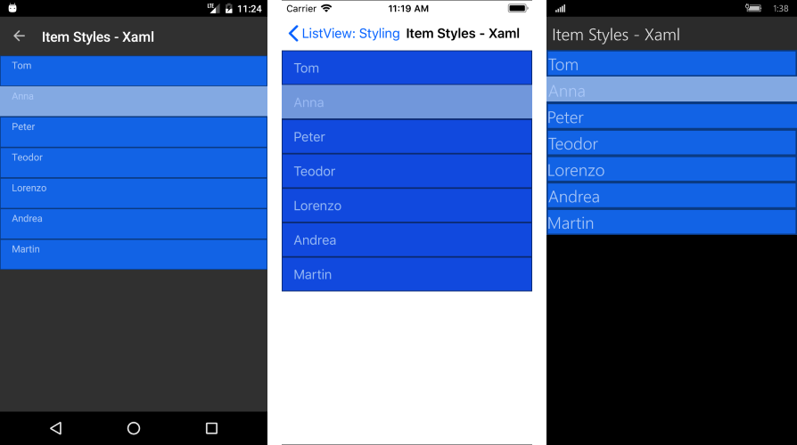
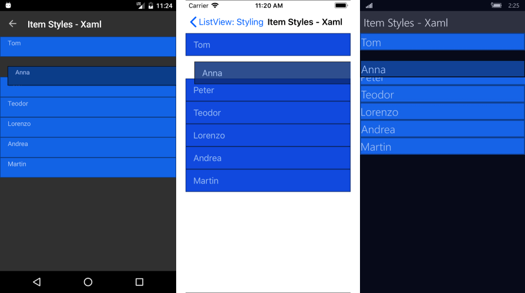
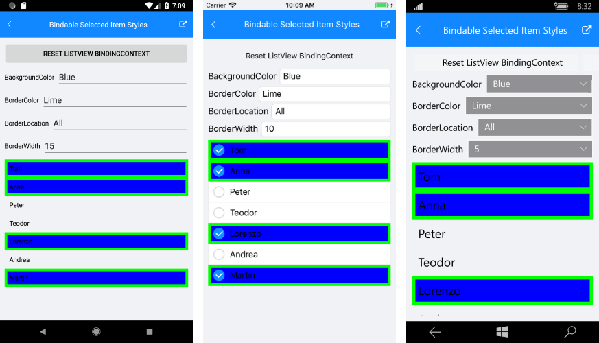

# Item Styles

The RadListView component provides styling mechanism for customizing the look of its items. This mechanism consists of the following properties of type "ListViewItemStyle":

* **ItemStyle**
* **SelectedItemStyle**
* **PressedItemStyle**
* **ReorderItemStyle**

## ListViewItemStyle

The properties of this object are respectively applied to the native components. The supported ones are the following:

* **BackgroundColor** (*Color*): sets the background of the item(s).
* **BorderColor** (*Color*): sets the color of the border.
* **BorderWidth** (*double*): defines the width of the borer.
* **BorderLocation** (*Location*): describes an enumeration describing where the border should be visible.
* **TextCellTextColor** (*Color*): defines the text color of the ListView TextCell.

### Location

This enumeration contains the following members:

- **None** - the border should not be visualized.
- **Top** - the border should be visualized only at the top side.
- **Bottom** -the border should be visualized only at the bottom side.
- **Left** - the border should be visualized only at the left side.
- **Right** - the border should be visualized only at the right side.
- **All** (default value) - the border should be visualized all around the item.

### Example

<snippet id='listview-styling-listview-xaml'/>
<snippet id='listview-styling-listview-csharp'/>

And here is the end result:

#### Figure 1: ListView with ItemStyle and SelectedItemStyle

#### Figure 2: ListView with ReorderItemStyle

>important You can find a working demo labeled **ItemStyles** in the ListView/Styling folder of the [SDK Samples Browser application](). 

## ListViewItemStyle with Bindable Properties

Additionally, the styling properties of **ListViewItemStyle**  could be used as bindable properties in order to allow you even more flexibility in customizing the visual appearance of RadListiView.

### Example

Here is a quick example on how you could bind ListViewItemStyle's properties to corresponding properties of type Color/Location inside the ViewModel:

<snippet id='listview-features-styling-bindable-itemstyle-xaml'/>

Here is how the ItemStyle bindable property looks:
#### Figure 3: ListView with Bindable ItemStyle

>important There are examples in the ListView/Styling folder of the [SDK Samples Browser application](), how you can use those properties as a bindable. 

## See Also

- [Selection]()
- [Reordering]()
- [StyleSelector]()
