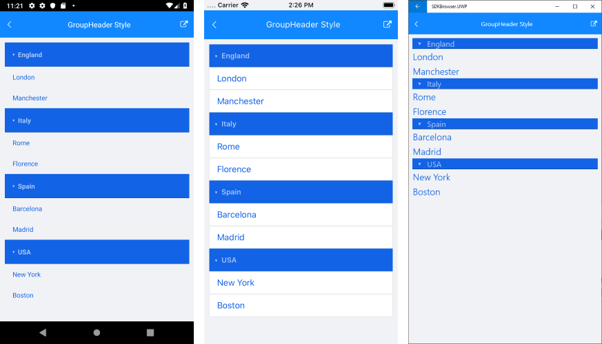

# GroupHeader Style

In addition to the [Item Styles](), RadListView gives the option to modify the visual appearance of its group headers when grouping is enabled. The feature is implemented through the ListView's **GroupHeaderStyle** property of type *ListViewGroupStyle*.

**ListViewGroupStyle** provides means for customizing the border as well as background and text color of the group headers. Below you can find a list of the available styling options:

* **BackgroundColor** (*Color*): sets the background of the group header(s).
* **BorderColor** (*Color*): sets the color of the border.
* **BorderWidth** (*double*): defines the width of the borer.
* **BorderLocation** (*Location*): defines an enumeration describing where the border should be visible.
* **TextColor** (*Color*): defines the text color of the ListView GroupHeader.

>important To learn more about the grouping functionality of RadListView check [Grouping Overview]() topic.

### Example

Let's have a simple *City* class:

<snippet id='listview-groupstyle-source' />

And a sample *ViewModel* class:

<snippet id='listview-groupstyle-viewmodel' />

Set it as BindingContext:

<snippet id='listview-groupstyle-setvm' />

Lastly, add the RadListView definition with a **GroupHeaderStyle** applied:

<snippet id='listview-groupstyle-listview-xaml' />

And here is the end result:

#### Figure 1: ListView with GroupHeaderStyle

>important You can find a working demo labeled **GroupHeader Style** in the ListView/Styling folder of the [SDK Samples Browser application](). 

## See Also

- [Grouping]()
- [Item Styles]()
- [Items StyleSelector]()
