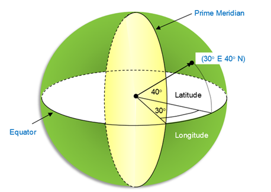

# Overview

The **RadMap** control visualizes spatial data using *layered architecture*. It could display spatial data points (e.g. location of cities), polylines (e.g. road connections), or polygons (shape of countries or continents) in a *geographic coordinate system*. In this coordinate system, a point on the surface of the earth is defined using latitudes and longitudes.

* **Latitude**: This is measured as the angle from the equatorial plane to the line drawn from the center of the earth to the point on the surface. Usually latitude values range from 90° (toward the North Pole and suffixed with "N") to -90° (towards the South Pole and suffixed with "S").
* **Longitude**: This is measured on the equatorial plane and is defined as the angle between the line drawn from the center of the earth to the point and the line drawn from center of the earth to the prime meridian. Usually the longitude values range from 180° (to the east of prime meridian and suffixed with "E") to -180° (to the west of prime meridian and suffixed with "W").

The position of the spatial data is described by the **Location** structure, that has the following properties:

* **Latitude** (double): Gets the latitude value of the location. The value should be between -90° and 90°.
* **Longitude** (double): Gets the longitude value of the location. The value should be between -180° and 180°.

The RadMap control works with layers of type *ShapefileLayer* that use ESRI shapefiles as a data source. For detailed information on how shapefiles could be utilized go to [ShapefileLayer]() topic.

## See Also

- [ShapefileLayer]()
