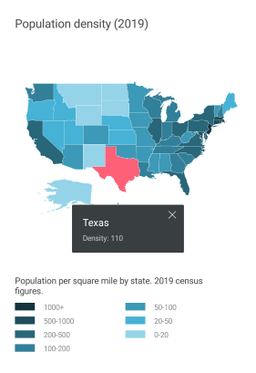

# Overview

**Telerik Map for Xamarin** is a data visualization control whose primary purpose is to visualize rich spatial data. The control provides visualization of ESRI shapefiles that consist of geometric objects, such as lines, polylines and polygons. Such objects are commonly used to display various schemes, for example floor plans and seats distribution, all the way to parts of maps for countries, roads, rivers, etc.

#### Figure 1: RadMap Overview

## Key features

* **Shape File(s) visualization**: RadMap can display rich spatial data from ESRI shapefiles. Each shapefile should be loaded and configured through a ShapefileLayer instance added to the Layers collection of the control. For more details on this check [Layers Overview]() topic.
* **Support for multiple layers**: The layered architecture of the control provides the option to load multiple shapefiles, so you can visualize different types of elements on the same map.
* **Various ways to load shapefiles**: You could load the shapefiles from a stream, from a file added as embedded resource or a file located on the device, etc. For more details check [here]().
* **Pan and Zooming**: RadMap provides pan and zoom functionality that will help you interact with the view and inspect your data. You could choose between only pan, only zoom or both through *InteractionMode* property. For more details go [here]().
* **Shape Labels**: You can show a label for each shape in the RadMap control through the *LabelAttributeName* property of the ShapefileLayer instance.
* **Selection**: The control supports single and multiple selection of shapes to help you draw attention on specific areas. Read the [Selection]() topic for more details regarding this feature.
* **Commands**: RadMap allows you to replace the default behavior of ZoomIn and ZoomOut commands with a custom implementation. For detailed information on the matter check [Commands]() article. 
* **Shapes Styling**: You could apply various Fill and Stroke colors to the shapes to make the map consistent with the design of your app. For more details check [Styling]() article. 

## See Also

- [Getting Started]()
