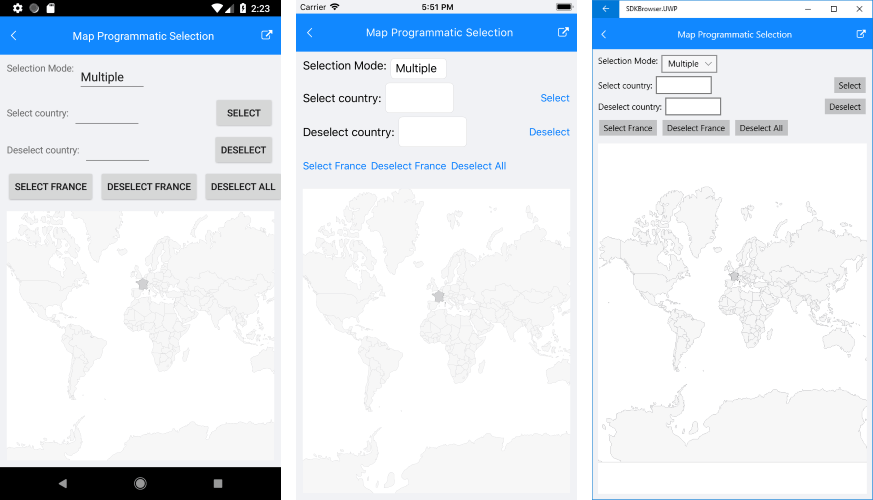

# Selection

RadMap control exposes selection feature. It allows users to select one or many shapes out of the source applied by each ShapefileLayer. This feature provides both visual and programmatic feedback for the actions of the user. 

The following members of the [ShapefileLayer]() class are related to the selection: 

* **SelectionMode**: Enum property which indicates what will be the selection. It could receive the following values:
	* None;
	* Single;
	* Multiple.

* **SelectedShape** (of type *IShape*): Defines the currently selected shape instance. When multiple selection is enabled, this value is set to the first selected shape. 
* **SelectedShapes** (of type *ObservableCollection&lt;IShape&gt;*): Reads the collection with the currently selected shapes. When the selection is single only one shape could be selected – thus the collection will have count = 1. 

* **SelectedShapeStyle** (of type *MapShapeStyle*): Defines the way selected shape look through the provided StrokeWidth, StrokeColor and FillColor properties. For more details on the MapShapeStyle usage go to [Shapes Styling]() topic.

The next snippet shows how **SelectionMode** is applied:

<snippet id='map-selection-mode-xaml' />

where the **Source** and the **DataSource** of the MapShapeReader should be set to a .shp and .dbf files, respectively:

<snippet id='map-selection-settintsource' />

Check below how RadMap with a few selected shapes will look like:

The snippet below demonstrates how you could select a certain shape programmatically. In the example the used ESRI file contains the world map, so the shape that is selected is a country. The example uses the **Shapes** property of the Map to traverse through all the available shapes.

Let's select/unselect "France", for example, on clicking buttons:

<snippet id='map-selectshapes-xaml' />

And here are the event handlers:

<snippet id='map-selection-runtime-code' />

Here is the result:

>important A sample Programmatic Selection example can be found in the Map/Selection folder of the [SDK Samples Browser application]().

## See Also

- [ShapefileLayer]()
- [Shapes Styling]()

