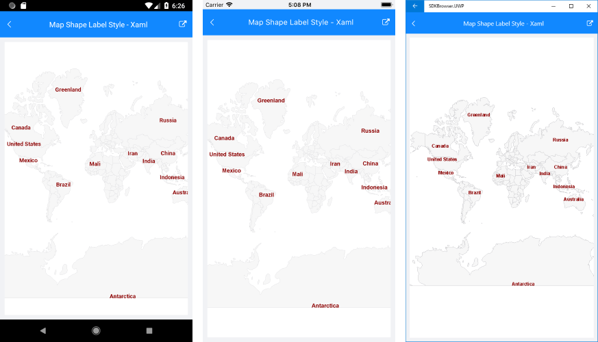

# Label Styling

The **ShapefileLayer** has a **ShapeLabelStyle** property that is of *MapShapeLabelStyle* type and defines the style of the labels.

MapShapeLabelStyle provides the following properties you could use to customize the way labels on the map will look:

* TextColor
* FontSize
* FontFamily
* FontAttributes

The snippet below shows how ShapeLabelStyle property can be applied:

<snippet id='map-styling-shapelabelstyle' />

where the **Source** and the **DataSource** of the MapShapeReader should be set to a .shp and .dbf files, respectively:

<snippet id='map-labels-settintsource' />

Here is the result:

>important A sample Labels Styling example can be found in the Map/Features folder of the [SDK Samples Browser application]().

## See Also

- [ShapefileLayer]()
- [Styling]()
