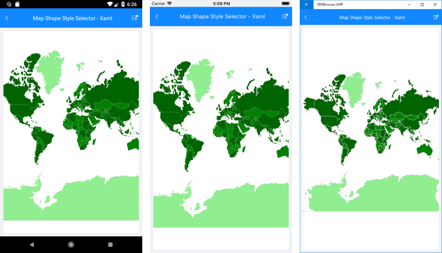

# Shapes Styling

The **ShapefileLayer** exposes **ShapeStyle**/**SelectedShapeStyle** as well as a **ShapeStyleSelector** properties that will help achieve the desired look &amp; feel of the shapes on the map.

## Shapes Styles

**ShapeStyle** and **SelectedShapeStyle** properties are of type *MapShapeStyle* which provides the following styling options for the shapes:

* StrokeWidth;
* StrokeColor;
* FillColor.

The snippet below shows how ShapeStyle property can be applied:

<snippet id='map-styling-shapeslstyle' />

Here is the result:

where the **Source** and the **DataSource** of the MapShapeReader should be set to a .shp and .dbf files, respectively:

<snippet id='map-labels-settintsource' />

## Shapes StyleSelector

Through the **ShapeStyleSelector** property of the ShapefileLayer you could implement conditional styling. 

The example below shows how to apply different styles to shapes according to certain property value of each shape.

First, create the selector class that should inherit from **MapShapeStyleSelector**:

<snippet id='map-shapesstyleselector-code' />

Then, define the selector with the Styles as a resource inside a ResourceDictionary:

<snippet id='map-styling-shapeslstyleselector-styles' />

Lastly, add the definition of the RadMap control with the PopulationShapeStyleSelector applied;

<snippet id='map-styling-shapeslstyleselector-xaml' />

Check the result in the screenshot below:

>important Sample Shapes Styling examples can be found in the Map/Features folder of the [SDK Samples Browser application]().

## See Also

- [ShapefileLayer]()
- [Labels Styling]()
