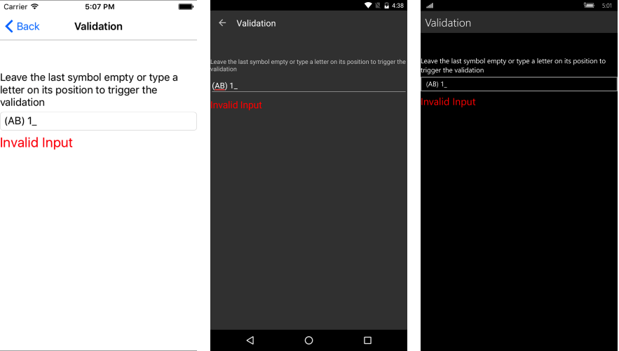

# Validation

The **RadMaskedInput** has a built-in validation mechanism, and you can utilize the following properties to modify the appearance when an input-related error is observed:

* **InvalidInputErrorText**: Gets or sets the text that is shown as error message on invalid input.
* **RejectedSymbolErrorText**:  Gets or sets the error text when a symbol was rejected.  
* **ErrorColor**: Gets or sets the color of the error text.
* **ErrorFontSize**: Gets or sets the font size of the error text.

>note The **ErrorColor** and **ErrorFontSize** will affect the error message from both the **InvalidInputErrorText** and the **RejectedSymbolErrorText** properties.

## InvalidInputErrorText

The message from this property will appear when you have a required symbol in the input which is not filled in(the '9' or '?' tokens are in use). Your users will be notified of the need to fill in the required symbol by noticing the custom message you have set.

Here is an example of how to trigger the error message.

The **RadMaskedInput** definition:

<snippet id='maskedinput-features-validation-xaml'/>

The way the mask is set, it is mandatory to fill in a digit in the last position. In case you leave it empty and move the focus from the field. **Figure 1** shows the appearance of the message.

#### **Figure 1: Invalid input error message**

## RejectedSymbolErrorText

The string set to the **RejectedSymbolErrorText** will be observed in case the input typed into the RadMaskedInput is rejected. In the case of the previously declared mask, this will happen if you try to type in a letter in the last symbol. The effect is observed in **Figure 2**.

#### **Figure 2: Rejected symbol error message**

## See Also

* [RadMaskedInput Tokens]()
* [RadMaskedInput Events]()
* [RadMaskedInput Commands]()