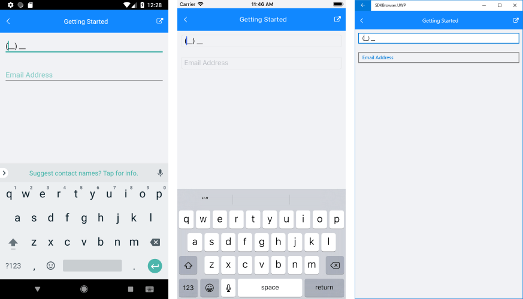

#  Getting Started

This article will guide you through the steps needed to add a basic **RadMaskedInput** control in your application and will provide information regarding the most important properties of the control. 

## 1. Setting up the app

Take a look at these articles and follow the instructions to setup your app:

- [Setup app with Telerik UI for Xamarin on Windows]()
- [Setup app with Telerik UI for Xamarin on Mac]()

## 2. Adding the required Telerik references

You have two options:

* Add the Telerik UI for Xamarin Nuget package following the instructions in [Telerik NuGet package server]() topic.

If you don't want to add the all Telerik.UI.for.Xamarin nuget package, you have the option to add a separate nuget package. For RadMaskedInput control you have to install the **Telerik.UI.for.Xamarin.Input** nuget package. This nuget will automatically refer the Telerik.UI.for.Xamarin.Primitives, Telerik.UI.for.Xamarin.Common, and Telerik.UI.for.Xamarin.DataControls nuget packages.

* Add the references to Telerik assemblies manually, check the list below with the required assemblies for **RadMaskedInput** component:

| Platform | Assemblies |
| -------- | ---------- |
| Portable | Telerik.XamarinForms.Common.dll Telerik.XamarinForms.Input.dll |
| Android  | Telerik.Xamarin.Android.Common.dll  Telerik.Xamarin.Android.Data.dll  Telerik.Xamarin.Android.Input.dll  Telerik.Xamarin.Android.List.dll   Telerik.Xamarin.Android.Primitives.dll  Telerik.XamarinForms.Common.dll  Telerik.XamarinForms.Input.dll |
| iOS      | Telerik.Xamarin.iOS.dll  Telerik.XamarinForms.Common.dll  Telerik.XamarinForms.Input.dll |
| UWP      | Telerik.Core.dll  Telerik.Data.dll  Telerik.UI.Xaml.Controls.Data.UWP.dll   Telerik.UI.Xaml.Input.UWP.dll  Telerik.UI.Xaml.Primitives.UWP.dll  Telerik.XamarinForms.Common.dll  Telerik.XamarinForms.Input.dll  |

## 3. Adding RadMaskedInput control

If your app is setup, you are ready to add a **RadMaskedInput** control.

The **RadMaskedInput** control exposes a **MaskType** property which can be either "**Text**" or "**Regex**". It controls the type of the validation. If you choose to use a Text type, the **Mask** of the control should be set by utilizing the [Mask Tokens](). In case you decide to use a Regex for validating the input, you should set such to the **Mask** property as demonstrated in the [RegEx Vaidation]() topic. 

Here is an example how to add RadMaskedInput control with **Text** MaskType:

<snippet id='maskedinput-gettingstarted-text-xaml'/>

In addition to this you need to add the following namespace:

<snippet id='xmlns-telerikinput'/>
<snippet id='ns-telerikinput'/>

This is the result:

## 4. Important Properties

The **RadMaskedInput** control exposes the following properties which you can configure:

### Mask-related properties:

* **MaskType**(*of type Telerik.XamarinForms.Input.MaskedInput.MaskType*): Defines the expected validation type of the Mask. Here are the two options: 
	* **Text** (for Tokens validation)
	* **Regex** (for RegEx validation)
* **Mask**(*string*): Specifies a string defining the mask. In case of using Text validation, you should use the available Mask Tokens. Otherwise, a regular expression should be set.
* **IsMaskFull**(*bool*): Gets a value indicating if all required symbols are filled. The default value is true. Can be false only when required symbols tokens are present in the mask. (*ReadOnly*)
* **InputValue**(*string*): Defines the input value.
* **IsInputAccepted**(*bool*): Gets a value indicating whether the input matches the mask.(*ReadOnly*)

### Appearance-related properties: 

* **WatermarkText**(*string*): Specifies the text used as watermark.
* **WatermarkTextColor**(*Color*): Specifies the color of the text of the watermark.
* **DisplayedText**(*string*): Gets the displayed text.(*ReadOnly*) 
* **DisplayedTextColor**(*Color*): Defines the color of the displayed text.
* **DisplayedTextFont**(*string*): Defines the font of the displayed text.
* **DisplayedTextFontSize**(*double*): Defines the size of the font used for the displayed text.
* **BorderStyle**(*of type Telerik.XamarinForms.Input.BorderStyle*) Gets or sets a Telerik.XamarinForms.Input.RadMaskedInput.BorderStyle defining the look of the border around the entry. The default value is defined by the OS.
* **Placeholder**(*char*): Specifies the symbol that will be used to mark an empty position. The default value is '_'.

### Validation-related properties: 

* **InvalidInputErrorText**(*string*): Defines the text that is shown as error message on invalid input.
* **ErrorColor**(*Color*): Specifies the color of the error text.
* **ErrorFontSize**(*double*): Specifies the font size of the error text.
* **RejectedSymbolErrorText**(*string*):  Defines the error text when a symbol was rejected.
* **IsErrorTextVisible**(*bool*): Gets a value indicating whether the error text is visible. (*ReadOnly*)

>important **SDK Browser** and **QSF** applications contain different examples that show RadMaskedInput's main features. You can find the applications in the **Examples** and **QSF** folders of your local **Telerik UI for Xamarin** installation.

## See Also

* [Tokens]()
* [RegEx]()
* [Validation]()
* [Commands]()
* [Events]()
* [Theming and Style]()
