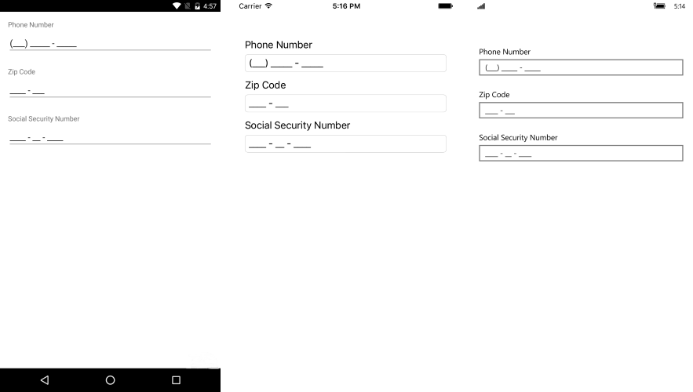

# Overview

**RadMaskedInput for Xamarin** allows to control the data input within your **Xamarin Forms** application. It enhances the functionality of the Entry control by adding input validation and custom masks which serve as a footprint for the user.

#### Figure 1: RadMaskedInput Overview

## Key features ##

* **Validation**: RadMaskedInput control uses a mask to distinguish between proper and improper user input. Validation mechanism can be based on custom regular expressions or built-in tokens. Read more about this in the [Tokens Validation]() and [RegEx Validation]() topics. 
* **Mask Tokens**: You could choose from a set of predefined tokens in order to restrict user’s input.  For more details on the available tokens go to [Tokens Validation]() topic.
* **Commands**: MaskedInput allows you to attach commands that will be executed when certain actions, such as ApplyMaskStarted and ApplyMaskFinished occur. For detailed information on the matter go to [Commands]() article. 
* **Customizable Validation UI**: With RadMaskedInput you could easily modify the appearance of the input-related errors, please refer to the [Validation UI]() topic for more details.

## See Also

- [Getting Started]()
