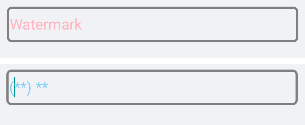
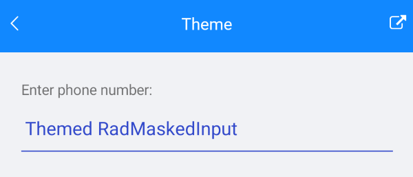
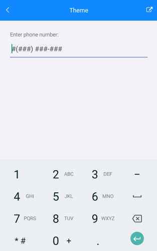

# Theming and Style

**RadMaskedInput** exposes the following properties for customizing the appearance of the control: 

* **WatermarkText**(*string*): Specifies the text used as watermark.
* **WatermarkTextColor**(*Color*): Specifies the color of the text of the watermark.
* **DisplayedText**(*string*): Gets the displayed text.(*ReadOnly*) 
* **DisplayedTextColor**(*Color*): Defines the color of the displayed text.
* **DisplayedTextFont**(*string*): Defines the font of the displayed text.
* **DisplayedTextFontSize**(*double*): Defines the size of the font used for the displayed text.
* **BorderStyle**(*of type Telerik.XamarinForms.Input.BorderStyle*) Gets or sets a Telerik.XamarinForms.Input.RadMaskedInput.BorderStyle defining the look of the border around the entry. The default value is defined by the OS.
* **Placeholder**(*char*): Specifies the symbol that will be used to mark an empty position. The default value is '_'.

## Example

Here is the **RadMaskedInput** definition with the properties described above applied:

```XAML
<StackLayout>
    <telerikInput:RadMaskedInput x:Name="maskedInput"
                                 WatermarkText="Watermark"
                                 WatermarkTextColor="LightPink"
                                 DisplayedTextColor="LightSkyBlue"
                                 DisplayedTextFontSize="20"
                                 Placeholder="*"
                                 Mask="(CC) 00"
                                 MaskType="Text">
        <telerikInput:RadMaskedInput.BorderStyle>
            <telerikInput:BorderStyle BorderColor="Gray" 
                                      BorderThickness="3" 
                                      CornerRadius="5"/>
        </telerikInput:RadMaskedInput.BorderStyle>
    </telerikInput:RadMaskedInput>
</StackLayout>
```

Here is how the control looks when the above properties are applied:



And here is how the control looks when Theming is applied:



And how the MaskedInpur control looks when in edit mode with `Keyboard` type `Telephone`.



>note You can find a working demo labeled **Theme** in the MaskedInput/Features folder of the [SDK Samples Browser application](). 

## See Also

* [RadMaskedInput Tokens]()
* [RadMaskedInput Events]()
* [RadMaskedInput Commands]()