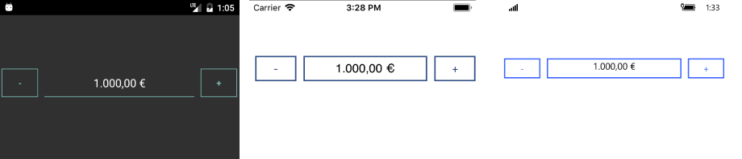

# Globalization

&nbsp;

Globalization is the process of designing and developing your application in such a way that it adapts to different culture configurations. The number formatting also varies between cultures, especially for some specific symbols, such as decimal separators, currency and other.

**RadNumericInput** provides you the option to define the format of its numeric value through the **StringFormat** property. You can set it to the desired format which will be applied when the control loses focus.

>tip You can find detailed information about the supported numeric formats here: [Standard Numeric Format Strings](https://docs.microsoft.com/en-us/dotnet/standard/base-types/standard-numeric-format-strings).

Any culture-specific symbols in the display format will be applied according to the UICulture of the current thread. If not set explicitly, the UICulture is taken from the target device.

Let’s, for example, have the following NumericInput where “C” represents the Currency symbol:

		<telerikInput:RadNumericInput StringFormat="{}{0:C2}" Value="1000" />

Depending on the UICulture of the current thread, the result is the following:

#### Figure 1: NumericInput with UICulture set to “en-US”

#### Figure 2: NumericInput with UICulture set to “de-DE”

> String format is applied when the NumericInput control loses focus. So, in case you’d like to switch the thread UICulture dynamically, you’d need to explicitly focus the NumericInput, then switch the focus to some other control, so that the change to take effect. 
>
> Here is a quick snippet:
>
> 		this.input.Focus();
> 		this.othercontrol.Focus();

## See Also

- [Key Features]()
- [Commands]()
