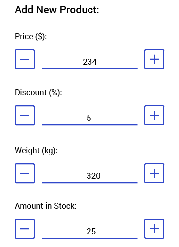

# Overview

**RadNumericInput** is a highly customizable input control for numeric data. It allows the user to set/edit a number using the decrease and increase buttons or directly enter it in the input field.  RadNumericInput also provides consistent look with the rest of the controls from the Telerik UI for Xamarin suite.

#### Figure 1: RadNumericInput Overview

## Key features

 * **Minimum/Maximum values**: RadNumericInput allows you to restrict the input value through Min/Max properties, check [here](#restricting-the-input) for more details.
 * **Increment Step**: You could define the step that will be applied to the input value upon each decrease/increase. Read more about this [here](#setting-the-step-for-decrementincrement-the-value).
 * **Customizable text of the buttons**: You could specify the text of the increase/decrease buttons, so that it’s applicable to your scenario, read [here](#setting-buttons-text) for more details.
 * **Commands**: You could use the NumericInput commands to define custom functionality upon decrease/increase action. Check the [Commands]() topic for more details.

## See Also

- [Getting Started]()
- [Key Features]()
- [Commands]()
