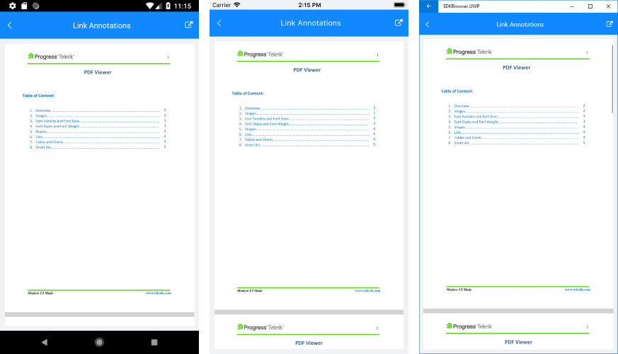

# Link Annotations

RadPdfViewer supports Link annotations, which means that if you open a PDF file that includes hyperlinks to absolute URIs, you can tap any of them and have a browser open, navigated to the respective address. In addition, if there are links pointing to bookmarks in the same document, the view port will be scrolled to the destination specified in the link.

RadPdfViewer provides the following **LinkAnnotationTapped** event which allows implementing custom logic related to links in the pdf document:

* **LinkAnnotationTapped**: Occurs when you click on an annotation such as a hyperlink. It comes handy when you want to detect or even cancel the opening of a web page. The LinkAnnotationTapped event handler receives two parameters:
	* The sender argument which is of type *object*, but can be cast to the *RadPdfViewer* type.
	* A __LinkAnnotationTappedEventArgs__ object which provides the link the user tapped on via the **LinkAnnotation** property and a cancellation option via the **Handled** boolean property. The **LinkAnnotation** has information of its Action, i.e if it is a UriAction or GoToAction (link to a position in the sampe document).

## Example

The example below demonstrates how you could detect whether the link annotation leads to a URI or a concrete position in the document, and cancel the navigation in the first case. 

Then, you could implement additional logic for requesting a confirmation from the end user whether to navigate outside of the app in the case of a hyperlink.

First, add the PdfViewer definition with the event:

<snippet id='pdfviewer-features-annotations-xaml' />

And here is the LinkAnnotationTapped event handler:

<snippet id='pdfviewer-annotations-event' />

Here is the result on different platforms after tapping on a hyperlink:

>important A sample Link Annotations example can be found in the PdfViewer/Features folder of the [SDK Samples Browser application]().

## See Also

- [PdfViewer Toolbar]()
