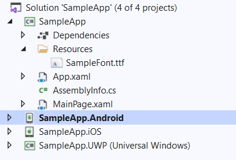

# Fonts

RadPdfViewer has a support for standard and embedded fonts. 

## Standard Fonts

There are 14 standard fonts that are not embedded in the document when you use them. As our Xamarin PdfViewer works with the [RadPdfProcessing](https://docs.telerik.com/devtools/document-processing/libraries/radpdfprocessing/overview) model, these fonts can be accessed through the PdfProcessing [FontsRepository class](https://docs.telerik.com/devtools/document-processing/api/telerik.windows.documents.fixed.model.fonts.fontsrepository). 

You can find a full list of the provided standard fonts below:

* Helvetica
* Helvetica-Bold
* Helvetica-Oblique
* Helvetica-BoldOblique
* Courier
* Courier-Bold
* Courier-Oblique
* Courier-BoldOblique
* Times-Roman
* Times-Bold
* Times-Italic
* Times-BoldItalic
* Symbol 
* ZapfDingbats

## Embedded Fonts

All fonts, which are not included in the 14 standard ones should be embedded in the PDF document. Otherwise, the result when the document is rendered is unpredictable as the PdfViewer renderer will fallback to the default fonts.

### Registering a Font

As RadPdfViewer for Xamarin works with [RadPdfProcessing library](https://docs.telerik.com/devtools/document-processing/libraries/radpdfprocessing/overview) model, you can utilize the PdfProcessing's FontsRepository **RegisterFont** static method to embed various fonts, including TrueType fonts. RegisterFont requires four parameters - FontFamily, FontStyle and FontWeight objects describing the font and a byte array containing the raw font data.

Here are the needed steps to embed a non-standard font with PdfProcessing library:

**Step 1**: Add the .ttf file containing the font data to your Xamarin.Forms project, in the example below it is placed inside Resources folder:



>Make sure to update the Build Action of the .ttf file to **Embedded resource**.

**Step 2**: Add a sample implementation for reading the font data from a stream, for example:

```C#
private static byte[] ReadAllBytes(Stream input)
{
	byte[] buffer = new byte[16 * 1024];
	using (MemoryStream ms = new MemoryStream())
	{
		int read;
		while ((read = input.Read(buffer, 0, buffer.Length)) > 0)
		{
			ms.Write(buffer, 0, read);
		}
		return ms.ToArray();
	}
}
```

**Step 3**: Embed the font through the **RegisterFont** method, here you need to use the above mentioned ReadAllBytes method to read the font data and return it as a byte array:

```C#
Assembly assembly = typeof(MainPage).Assembly;
Stream stream = assembly.GetManifestResourceStream("SampleApp.Resources.SampleFont.ttf");
var fontData = ReadAllBytes(stream);
Telerik.Windows.Documents.Fixed.Model.Fonts.FontsRepository.RegisterFont(
	new FontFamily("Verdana"), FontStyles.Normal, FontWeights.Normal, fontData);
```

Add the missing namespace related to the PdfProcessing library:

```C#
using Telerik.Documents.Core.Fonts;
```


**Result**: RadPdfViewer will use thus registered font data when rendering text with the same font set.

## See Also

- [RadPdfProcessing library](https://docs.telerik.com/devtools/document-processing/libraries/radpdfprocessing/overview)
