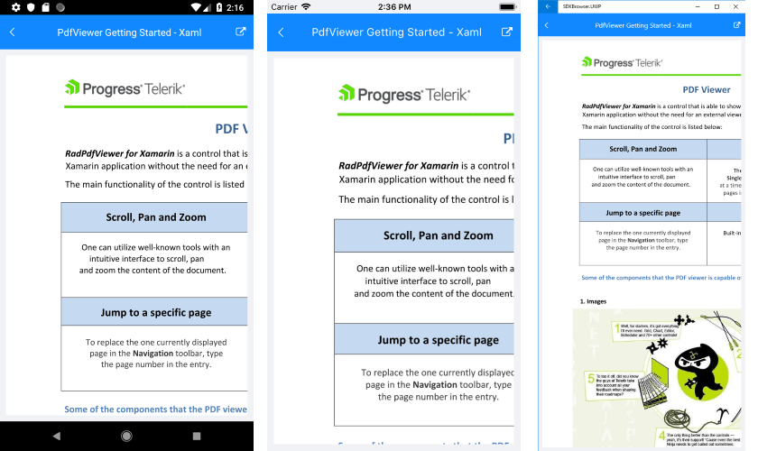

# Getting Started

This article will guide you through the steps needed to add a basic **RadPdfViewer** control in your application.

* [Setting up the app](#1-setting-up-the-app)
* [Adding the required Telerik references](#2-adding-the-required-telerik-references)
* [Adding RadPdfViewer control](#3-adding-radpdfviewer-control)
* [Visualize a Pdf Document](#4-visualize-a-pdf-document)

## 1. Setting up the app

Take a look at these articles and follow the instructions to setup your app:

- [Setup app with Telerik UI for Xamarin on Windows]()
- [Setup app with Telerik UI for Xamarin on Mac]()

## 2. Adding the required Telerik references

You have two options:

* Add the Telerik UI for Xamarin Nuget package following the instructions in [Telerik NuGet package server]() topic.

If you don't want to add the all Telerik.UI.for.Xamarin nuget package, you have the option to add a separate nuget package. For RadPdfViewer control you have to install the **Telerik.UI.for.Xamarin.PdfViewer** nuget package. This nuget will automatically refer the *Telerik.UI.for.Xamarin.Common*, *Telerik.UI.for.Xamarin.Primitives*, *Telerik.UI.for.Xamarin.SkiaSharp*, *SkiaSharp* and *ShiaSharp.Views.Forms* nuget packages.

* Add the references to Telerik assemblies manually, check the list below with the required assemblies for **RadPdfViewer** component:

| Platform | Assemblies |
| -------- | ---------- |
| Portable | Telerik.Documents.Core.dll<br/>Telerik.Documents.Fixed.dll<br/>Telerik.XamarinForms.PdfViewer.dll<br/>Telerik.XamarinForms.Common.dll<br/>Telerik.XamarinForms.Primitives.dll<br/>Telerik.XamarinForms.SkiaSharp.dll |
| Android  | Telerik.Documents.Core.dll<br/>Telerik.Documents.Fixed.dll<br/>Telerik.Xamarin.Android.Primitives.dll<br/>Telerik.Xamarin.Android.Common.dll<br/>Telerik.XamarinForms.PdfViewer.dll<br/>Telerik.XamarinForms.Common.dll<br/>Telerik.XamarinForms.Primitives.dll<br/>Telerik.XamarinForms.SkiaSharp.dll |
| iOS      | Telerik.Documents.Core.dll<br/>Telerik.Documents.Fixed.dll<br/>Telerik.Xamarin.iOS.dll<br/>Telerik.XamarinForms.PdfViewer.dll<br/>Telerik.XamarinForms.Common.dll<br/>Telerik.XamarinForms.Primitives.dll<br/>Telerik.XamarinForms.SkiaSharp.dll |
| UWP      | Telerik.Core.dll<br/>Telerik.Documents.Core.dll<br/>Telerik.Documents.Fixed.dll<br/>Telerik.UI.Xaml.Primitives.UWP.dll<br/>Telerik.XamarinForms.PdfViewer.dll<br/>Telerik.XamarinForms.Common.dll<br/>Telerik.XamarinForms.Primitives<br/>Telerik.XamarinForms.SkiaSharp.dll |

>important Please keep in mind that **Telerik.Documents.Core.dll** and **Telerik.Documents.Fixed.dll** assemblies are located in the Portable folder, still, you need to add a reference to them in each of the platform projects.

## 3. Adding RadPdfViewer control

You could use one of the following approaches:

#### Drag the control from the Toolbox. 

Take a look at the following topics on how to use the toolbox:

* [Telerik UI for Xamarin Toolbox on Windows]()
* [Telerik UI for Xamarin Toolbox on Mac]()
	
#### Create the control definition in XAML.

<snippet id='prfviewer-getting-started-xaml' />

In addition to this, you need to add the following namespace:

```XAML
xmlns:telerikPdfViewer="clr-namespace:Telerik.XamarinForms.PdfViewer;assembly=Telerik.XamarinForms.PdfViewer"
```

## 4. Visualize a Pdf Document

>important To visualize the pdf document you will need to set the *Source* property of the control.

* **Source** (DocumentSource): Defines the source of the document.

>note The example below shows a pdf document visualized as an EmbeddedResource. This is one of the options for loading a pdf inside PdfViewer control, you could check the others in the [Key Features]() topic.

<snippet id='pdfviewer-getting-started' />

This is the result:



## See Also

- [Key Features]()
- [Commands]()
- [PdfViewer Toolbar]()
