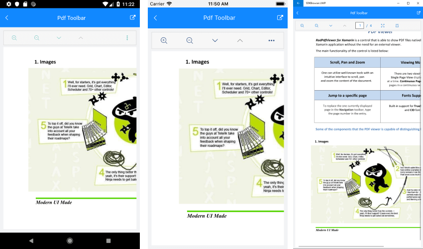

# Key Features

The purpose of this help article is to show you the key features of the **RadPdfViewer** control.

## Pdf Document Visualization

RadPdfViewer control enables you to visualize Pdf documents through the **Source** property of type *Telerik.XamarinForms.PdfViewer.DocumentSource*. 

The Pdf Document could be loaded from:

* **RadFixedDocument** - it is used to load the pdf document from a stream.

>tip Using this approach you have more control over the loading process, for example, you could modify the document after it is imported and before it is assigned as a Source to the PdfViewer control. For more details check [RadFixedDocument](https://docs.telerik.com/devtools/document-processing/libraries/radpdfprocessing/model/radfixeddocument) topic from RadPdfProcessing documentation. 

You could use it in two ways:

<snippet id='pdfviewer-key-features-source-fixed-method' />

or 
```C#
private void ImportFixedDocument()
{
    Telerik.Windows.Documents.Fixed.FormatProviders.Pdf.PdfFormatProvider provider = new Telerik.Windows.Documents.Fixed.FormatProviders.Pdf.PdfFormatProvider();
    Assembly assembly = typeof(KeyFeatures).Assembly;
    string fileName = assembly.GetManifestResourceNames().FirstOrDefault(n => n.Contains("pdfviewer-overview.pdf"));
    using (Stream stream = assembly.GetManifestResourceStream(fileName))
    {
        RadFixedDocument document = provider.Import(stream);
        this.pdfViewer.Source = new FixedDocumentSource(document);
    }
}
```

* **Uri**

<snippet id='pdfviewer-key-features-source-uri' />

or 
```C#
Uri uri = this.GetUri();
this.pdfViewer.Source = new UriDocumentSource(uri);
```

where GetUri() method returns a valid and accessible URL.

* **File** - you can visualize the pdf document from a file located on a device (available since R1 2019 SP). You just need to pass the file path to the *Source* property of the PdfViewer control:

```C#
this.pdfViewer.Source = filePath;
```

where the filePath variable is a string that contains the path to the file location.

In order to make sure that the file exists on the device you could use the following code:

```C#
System.IO.File.OpenRead(filePath);
```

>important Please make sure that you have granted the app all the permissions needed before the resources are used. Otherwise, an error will be raised.

* **Byte Array**

<snippet id='pdfviewer-key-features-source-byte' />

or
```C#
byte[] bytes = this.GetBytes();
this.pdfViewer.Source = new ByteArrayDocumentSource(bytes, true);          
```

* **Stream**

There are two ways:

<snippet id='pdfviewer-key-features-stream' />

or
```C#
Assembly assembly = typeof(KeyFeatures).Assembly;
string fileName = assembly.GetManifestResourceNames().FirstOrDefault(n => n.Contains("pdfviewer-overview.pdf"));
Stream stream = assembly.GetManifestResourceStream(fileName);
var streamDocumentSource = new StreamDocumentSource();
streamDocumentSource.Import(stream);
this.pdfViewer.Source = streamDocumentSource;
```

>note If you choose the second approach with StreamDocumentSource, please keep in mind the stream must stay open while the PdfViewer is in use, because the pdf import is [ReadOnDemand](#readondemand-loading). This means that you'd need to manually close the stream when no longer using the PdfViewer.

## ReadOnDemand Loading

RadPdfViewer control provides ReadOnDemand loading of the Pdf document, which means that each page of the document is loaded dynamically when necessary (when needed to be shown in the PdfViewer) and it is unloaded once it becomes invisible. The stream that holds the document stays opened while the document is used in PdfViewer.

## Document Reference

Through the **Document** property of RadPdfViewer you can get a reference to the **RadFixedDocument** imported by the DocumentSource. For more details check [RadFixedDocument](https://docs.telerik.com/devtools/document-processing/libraries/radpdfprocessing/model/radfixeddocument) topic from RadPdfProcessing documentation. 

## Zoom Level Support

RadPdfViewer exposes properties for applying min and max zoom values.

* **MaxZoomLevel**(double): Defines the maximum magnification factor at which content could be maximized. The default value is 3.0
* **MinZoomLevel**(double): Defines the minimum magnification factor at which content could be minimized. The default value is 0.3

>note In order to check how these properties works you should set the ZoomIn and ZoomOut Commmands of the control. For more details please check the [Commands]() article.

## Viewing Modes

You could easily set one of the two layout modes that the control provides through its **LayoutMode** property.

The available options are:

* **ContinuousScroll**: Displays pages in a continuous vertical column.
* **SinglePage**: Displays one page at a time.

>note By default the PdfViewer LayoutMode property is set to **ContinuousScroll**.

>tip The RadPdfViewer LayoutMode could be triggered through the **ToggleLayoutModeCommand** and the **ToggleLayoutModeToolbarItem**.

Here is how the PdfViewer looks when LayoutMode is set to ContinuousScroll:


And when the LayoutMode property is set to SinglePage:



## Page Spacing

* **PageSpacing**(double): Defines the space between the pages of the Pdf Document. The default value is 20.0

## PagesStart Index

* **VisiblePagesStartIndex**(int): Defines the index at which the document will be displayed. The default value is 0.

## BusyIndicator Template

If the default busy template does not suit your needs, you could easily define a custom template through the following property:

* **BusyIndicatorTemplate**(DataTemplate): Specifies the template visualized while the Pdf Document is loading.

Here is an example how the custom BusyIndicatorTemplate could be defined:

<snippet id='pdfviewer-busy-indicator-template-xaml' />

Here is how the BusyIndicator Template looks:


>important A sample BusyIndicatorTemplate example can be found in the PdfViewer/Features folder of the [SDK Samples Browser application]().

## Example

Here is an example how the above RadPdfViewer features could be applied:

For the example we will visualize a pdf document from file embedded in the application with a **BuildAction:EmbeddedResource**.

Then add the following code to load the pdf document from Stream:

<snippet id='pdfviewer-key-features-stream'/>

Finally, use the following snippet to declare a RadPdfViewer in XAML:

<snippet id='pdfviewer-key-features-xaml'/>

and add the following namespace:

<snippet id='xmlns-telerikprimitives'/>

Where the **telerikPdfViewer** namespace is the following:

```XAML
xmlns:telerikPdfViewer="clr-namespace:Telerik.XamarinForms.PdfViewer;assembly=Telerik.XamarinForms.PdfViewer"
```
 
>important A sample Key Features example can be found in the PdfViewer/Features folder of the [SDK Samples Browser application]().

## See Also

- [Commands]()
- [PdfViewer Toolbar]()
