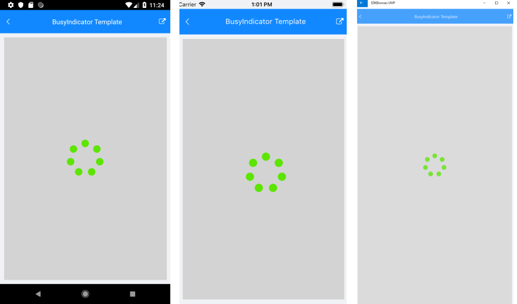

# Key Features

The purpose of this help article is to show you the key features of the **RadPdfViewer** control.

## Pdf Documment Visualization

RadPdfViewer control enables you to visualize Pdf documents through the following property:

* **Source**(DocumentSource): Defines the source of the document. 

The Pdf Document could be loaded from:

* **FixedDocument** 

<snippet id='pdfviewer-key-features-source-fixed-method' />

or 
```C#
private void ImportFixedDocument()
{
    Telerik.Windows.Documents.Fixed.FormatProviders.Pdf.PdfFormatProvider provider = new Telerik.Windows.Documents.Fixed.FormatProviders.Pdf.PdfFormatProvider();
    Assembly assembly = typeof(KeyFeatures).Assembly;
    string fileName = assembly.GetManifestResourceNames().FirstOrDefault(n => n.Contains("pdfviewer-overview.pdf"));
    using (Stream stream = assembly.GetManifestResourceStream(fileName))
    {
        RadFixedDocument document = provider.Import(stream);
        this.pdfViewer.Source = new FixedDocumentSource(document);
    }
}
```

* **Uri**

<snippet id='pdfviewer-key-features-source-uri' />

or 
```C#
Uri uri = this.GetUri();
this.pdfViewer.Source = new UriDocumentSource(uri);
```

* **File**

>important From R1 2019 SP the RadPdfViewer supports FileDocumentSouce. 

You can visualize the pdf document from a file located on a device.

In order to make sure that the file exist on the device you could use the following code:

```C#
System.IO.File.OpenRead(path)
```

where the path is a sting that contains the path to the file location.

Also make sure that you have grant to the app all the permissions needed before the resources are used.

* **Byte Array**

<snippet id='pdfviewer-key-features-source-byte' />

or
```C#
byte[] bytes = this.GetBytes();
this.pdfViewer.Source = new ByteArrayDocumentSource(bytes, true);          
```

* **Stream**

<snippet id='pdfviewer-key-features-stream' />

## Zoom Level Support

RadPdfViewer exposes properties for applying min and max zoom values.

* **MaxZoomLevel**(double): Defines the maximum magnification factor at which content could be maximized. The default value is 3.0
* **MinZoomLevel**(double): Defines the minimum magnification factor at which content could be minimized. The default value is 0.3

>note In order to check how these properties works you should set the ZoomIn and ZoomOut Commmands of the control. For more details please check the [Commands]() article.

## Viewing Modes

You could easily set one of the two layout modes that the control provides through its **LayoutMode** property.

The available options are:

* **ContinuousScroll**: Displays pages in a continuous vertical column.
* **SinglePage**: Displays one page at a time.

>note By default the PdfViewer LayoutMode property is set to **ContinuousScroll**.

>tip The RadPdfViewer LayoutMode could be triggered through the **ToggleLayoutModeCommand** and the **ToggleLayoutModeToolbarItem**.

Here is how the PdfViewer looks when LayoutMode is set to ContinuousScroll:


And when the LayoutMode property is set to SinglePage:


## Page Spacing

* **PageSpacing**(double): Defines the space between the pages of the Pdf Document. The default value is 20.0

## PagesStart Index

* **VisiblePagesStartIndex**(int): Defines the index at which the document will be displayed. The default value is 0.

## BusyIndicator Template

If the default busy template does not suit your needs, you could easily define a custom template through the following property:

* **BusyIndicatorTemplate**(DataTemplate): Specifies the template visualized while the Pdf Document is loading.

Here is an example how the custom BusyIndicatorTemplate could be defined:

<snippet id='pdfviewer-busy-indicator-template-xaml' />

Here is how the BusyIndicator Template looks:



>important A sample BusyIndicatorTemplate example can be found in the PdfViewer/Features folder of the [SDK Samples Browser application]().

## Example

Here is an example how the above RadPdfViewer features could be applied:

For the example we will visualize a pdf document from file embedded in the application with a **BuildAction:EmbeddedResource**.

Then add the following code to load the pdf document from Stream:

<snippet id='pdfviewer-key-features-stream'/>

Finally, use the following snippet to declare a RadPdfViewer in XAML:

<snippet id='pdfviewer-key-features-xaml'/>

Where the **telerikPdfViewer** namespace is the following:

```XAML
xmlns:telerikPdfViewer="clr-namespace:Telerik.XamarinForms.PdfViewer;assembly=Telerik.XamarinForms.PdfViewer"
```
 
>important A sample Key Features example can be found in the PdfViewer/Features folder of the [SDK Samples Browser application]().

## See Also

- [Commands]()
- [PdfViewer Toolbar]()
