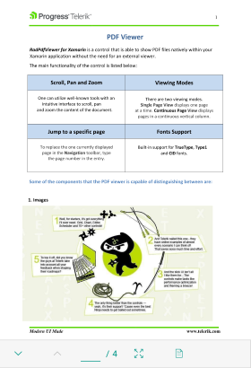

# Overview

RadPdfViewer for Xamarin is a control that enables you to easily load and display PDF documents natively in your application. It has been made more than simple with the exposed commands that can be easily bound to and the full integration with the RadPdfViewerToolbar.

#### Figure 1: RadPdfViewer Overview

## Key Features

* RadPdfViewer provides an option for **zoom in and zoom out** the content of the document. For more details on this check [here]().
* **Single page and Continuous scrolling** support – allows you to scroll the document in the viewer. Read [here]() for more details.
* **Commands Support** - RadPdfViewer allows you to extend the default commands, such as ZoomIn, ZoomOut, NavigateTo (NextPage, PreviousPage, Page), FitToWidth and ToggleLayoutMode. For detailed information on the matter check [Commands]() article. 
* **RadPdf Toolbar** *(Build-In Commands Operations)* - is a pre-defined UI that automatically wired with all of the commands provided by the control through Build-in functionality. Check [here]() for more info.
* **Font Support** Build -in support for True Type, Type1 and CID fonts.
* **Visualize pdf documents** that inclide: Images, Shapes (geometrics), Different colors(solid, linear and radial gradients), Ordered and bullet list, etc. 

## See Also

- [Getting Started]()
- [Key Features]()
- [Commands]()
