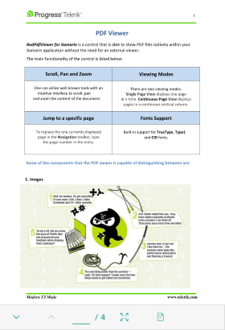

# Overview

RadPdfViewer for Xamarin is a control that enables you to easily load and display PDF documents natively in your application. It has been made more than simple with the exposed commands that can be easily bound to and the full integration with the RadPdfViewerToolbar.

#### Figure 1: RadPdfViewer Overview

## Key Features

* **Visualize pdf documents**: RadPdfViewer could display pdf documents that include images, shapes (geometrics), different colors(solid, linear and radial gradients), ordered and bullet lists, and more. 
* **Zooming Functionality**: RadPdfViewer provides an option for **zoom in and zoom out** the content of the document. For more details on this check [here]().
* **Single page and Continuous Scrolling Support**: Allows you to scroll the document in the viewer. Read [here]() for more details.
* **Commands Support**: RadPdfViewer allows you to extend the default commands, such as ZoomIn, ZoomOut, NavigateTo (NextPage, PreviousPage, Page), FitToWidth and ToggleLayoutMode. For detailed information on the matter check [Commands]() article. 
* **RadPdf Toolbar** *(Build-In Commands Operations)*: You could take advantage of a pre-defined UI automatically wired with all of the commands provided by the control through built-in functionality. Check [here]() for more info.

## See Also

- [Getting Started]()
- [Key Features]()
- [Commands]()
