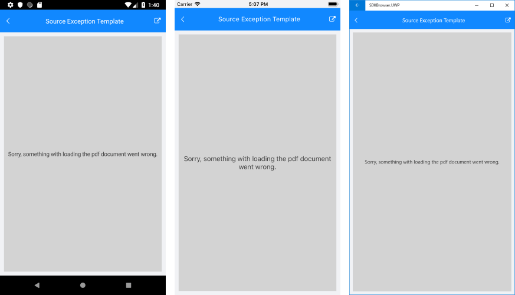

# Source Exception Handling

In certain cases RadPdfViewer will not be able to load the passed Pdf document - it can be due to invalid stream/inaccessible URL or some invalid data in the document itself. RadPdfViewer provides a way to catch these cases through its **SourceException** event. In addition, you could show a user-friendly message to the users through **SourceExceptionTemplate**.

Check the example below which shows how to use the RadPdfViewer API for handling source exceptions.

First, define RadPdfViewer control and apply a SourceExceptionTemplate. The snippet below demonstrates a sample template with only one Label which holds the message. 

<snippet id='pdfviewer-source-exception-xaml' />

Where the **telerikPdfViewer** namespace is the following:

```XAML
xmlns:telerikPdfViewer="clr-namespace:Telerik.XamarinForms.PdfViewer;assembly=Telerik.XamarinForms.PdfViewer"
```

And here is the SourceException event handler:

<snippet id='pdfviewer-sourceexception-eventhandler' />

Check below how the defined SourceTemplateException looks:



>important A sample SourceExceptionTemplate example can be found in the PdfViewer/Features folder of the [SDK Samples Browser application]().

## See Also

- [PdfViewer Toolbar]()
