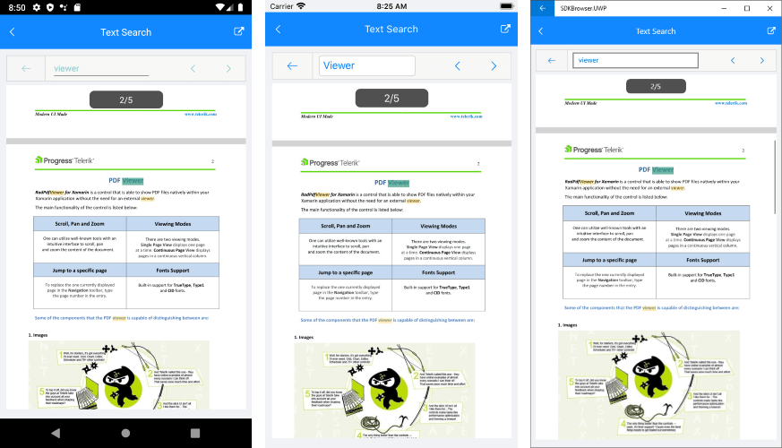
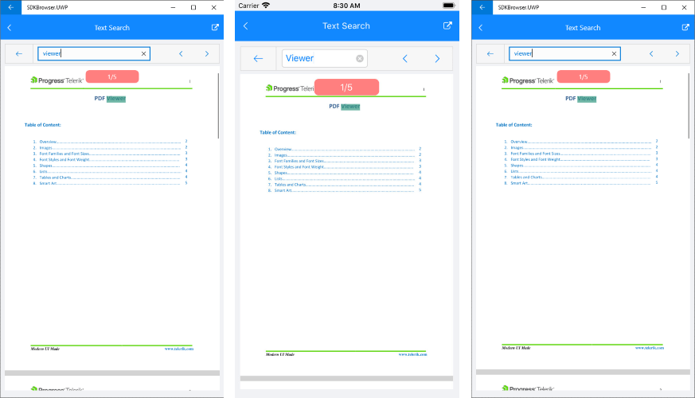
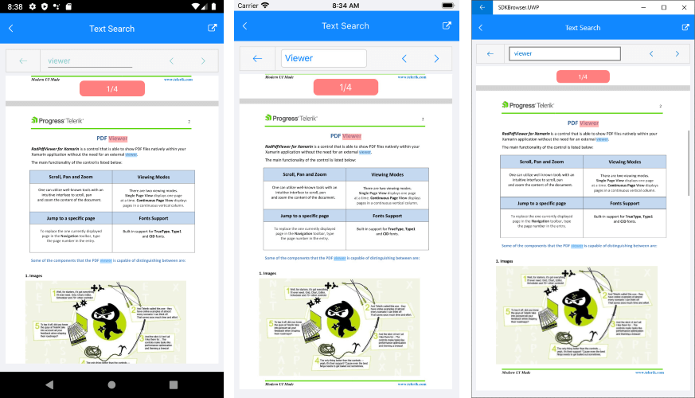

# Text Search

With R3 2020 PdfViewer for Xamarin comes with text search functionality which allows users to find and highlight text inside the pdf document. 

You can take advantage of the PdfViewerToolbar bult-in search UI or search programmatically through the provided methods. With the built-in search UI users can easily enter text and browse through the search results withing the PdfViewer toolbar. In addition, there is a small toast message showing the count of the search results or a localizable message in case no results are found.



This topic will go through the search text feature in details as well as the customization options it provides.

## PdfViewerToolbar Search UI

PdfViewerToolbar exposes a new **SearchToolbarItem** which enables the search feature inside the loaded in the viewer pdf document. You can add the SearchToolbarItem at any location inside the toolbar, check below a sample definition of RadPdfViewerToolbar:

```XAML
<telerikPdfViewer:RadPdfViewerToolbar PdfViewer="{Binding Source={x:Reference pdfViewer}}">
    <telerikPdfViewer:SearchToolbarItem />
    <telerikPdfViewer:ZoomInToolbarItem />
    <telerikPdfViewer:ZoomOutToolbarItem />
</telerikPdfViewer:RadPdfViewerToolbar>
```
 
When the user clicks the search toolbar item, all of the the current toolbar items are hidden and new child items are displayed - back button along with an input for entering search. This way when the user has finished searching they can easily go back. 

As soon as the user types into the entry, a clear button is shown to enable quickly clear the entered text and reset the search. 


> If the text in the entry is cleared, the search results will be cleared as well.

By default, search is performed when the user clicks the Search button of the keyboard (or the Enter key of the physical keyboard in UWP). You can modify this behavior through the **SearchTrigger** property of the SearchToolbarItem. SearchTrigger is of enum *Telerik.XamarinForms.PdfViewer.SearchTrigger* and is used to define when a search operation should be performed. The available values are:

* None -  only programmatic calls will start a search operation.
* TextChanged - a search is triggered every time the Text is changed.
* Completed (default) - a search operation is triggered when the corresponding entry completes (by pressing Enter/Return key).

SearchToolbarItem provides **ToastStyle** property used to style the toast message showing the count of the search results or a message in case no results are found.  

The snippet below shows how you can modify the SearchTrigger and the ToastStyle of a SearchToolbarItem:

```XAML
<telerikPdfViewer:RadPdfViewerToolbar PdfViewer="{Binding Source={x:Reference pdfViewer}}">
	<telerikPdfViewer:SearchToolbarItem TextSearchTrigger="TextChanged"
										ToastStyle="{StaticResource MyToastStyle}" />
</telerikPdfViewer:RadPdfViewerToolbar>
```

Where MyToastStyle is defined like this:

```XAML
<Style x:Key="MyToastStyle" TargetType="telerikPdfViewer:SearchToast">
	<Setter Property="Fill" Value="#FF7F7F" />
	<Setter Property="TextColor" Value="White" />
</Style>											
```

Check the result below:



## Text Search Configuration

RadPdfViewer exposes **SearchSettings** property which you can use to configure the search functionality, such as search criteria, commands, highlight colors, etc.

This section lists the properties of the SearchSettings, so you can customize it per your needs.

### Search Text

Through the **Text** property of the SearchSettings you can retrieve or explicitly set the search text (in case you prefer not using the built-in search UI).

### Search Options

SearchOptions is of type [Telerik.Windows.Documents.Fixed.Search.TextSearchOptions](https://docs.telerik.com/devtools/document-processing/api/telerik.windows.documents.fixed.search.textsearchoptions) and is used to define some search criteria as listed below:

* UseRegularExpression - specifies whether a regular expression should be used for searching.
* CaseSensitive - indicates whether the search should be case sensitive.
* WholeWordsOnly - indicates whether only whole words should be matched.

### Highlight Colors

SearchSettings exposes two Color properties - **MainSearchResultFill** and **SearchResultsFill**.  When a search is initiated, the found search results are highlighted. Two highlight colors are needed, as exactly one of all results has the **MainSearchResultFill** and is considered to be the main-result. This is for navigation purposes, so that a user will be able to navigate to previous and next results and keep track. The rest of the results are colored in the **SearchResultsFill**.

Here is an example of how you can customize SearchOptions as well as highlight colors:

First, let's add the PdfViewer together with PdfViewerToolbar with the **SearchSettings** applied:

<snippet id='pdfviewer-textsearch-xaml' />

Add the needed namespaces:

```XAML
xmlns:telerikPdfViewer="clr-namespace:Telerik.XamarinForms.PdfViewer;assembly=Telerik.XamarinForms.PdfViewer"
xmlns:telerikTextSearch="clr-namespace:Telerik.Windows.Documents.Fixed.Search;assembly=Telerik.Documents.Fixed"
```

Here is how the text selection looks after the applied modifications:



>important A sample Text Search example can be found in the PdfViewer/Features folder of the [SDK Samples Browser application]().

### Search Results

**TextSearchResult** property of the SearchSettings retrieves the current search result. It contains all the results that are found and as well as the main result. Main result is highlighted differently from the other search results and is used for navigation purposes, so that the user will be able to navigate to previous and next results and keep track.  

TextSearchResult exposes the following properties:

* static <code>TextSearchResult.NotFound</code> property - returned in case there are no results per the search criteria;
* <code>SearchResults</code> collection - contains all the search results of type [Telerik.Windows.Documents.Fixed.Search.SearchResult](https://docs.telerik.com/devtools/document-processing/api/telerik.windows.documents.fixed.search.searchresult).
* <code>MainSearchResult</code> - a reference to the search result considered as main result.

### Commands for browsing the search results

SearchSettings exposes **NavigateToPreviousSearchResultCommand** and **NavigateToNextSearchResultCommand** used to browse between the search results. You can bind these commands in case you'd like to implement browse previous/next search results actions from a custom UI, for example:

```XAML
<Button Text="Previous" Command="{Binding Source={x:Reference pdfViewer}, Path=SearchSettings.NavigateToPreviousSearchResultCommand}" />
<Button Text="Next" Command="{Binding Source={x:Reference pdfViewer}, Path=SearchSettings.NavigateToNextSearchResultCommand}" />
```

### Manual Search

You can use the **SearchAsync** method of the SearchSettings to manually initiate an async search operaion with the provided text and search options:

```C#
pdfViewer.SearchSettings.SearchAsync("viewer");
```

## Custom Search

You can extend the search functionality by implementing a custom **TextSearchWorker**. TextSearchWorker object performs the actual search according to the search criteria.

The example below implements a custom search by multiple words - any word that is entered into the input is considered as a separate search text.

First, create a custom class that derives from **TextSearchWorker** - you'd need to override the <code>Search</code> method that returns *TextSearchResult* object:

<snippet id='pdfviewer-textsearchworker' />

Then you need to apply the <code>MultipleWordsSearchWorker</code> object to the **TextSearchWorker** property of the SearchSettings of RadPdfViewer:

<snippet id='pdfviewer-customtextsearch-xaml' />

## See Also

- [PdfViewer Toolbar]()
- [Text Selection]()
