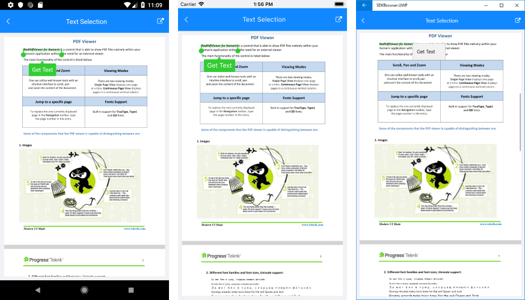

# Text Selection

With R3 2019 release of Telerik UI for Xamarin RadPdfViewer supports text selection functionality - the end user can initiate a selection action through the hold gesture over the text. The selected text is marked with a different background color and two drag handles are available to the user to make it easier to modify the current selection. In addition, as soon as the selection is made, PdfViewer displays a customizable SelectionMenu with a default Copy command to allow the user to retrieve the selected text.

>note On UWP the text selection is initialized through mouse click and drag actions - continuous drag extends the current selection. SelectionMenu can be displayed on UWP through right-click over the selected text.

This topic will go through the text selection feature in details as well as the customization options it provides.

## Selection Settings

Through the **SelectionSettings** property of RadPdfViewer control you can modify the colors applied to the selected text as well as to completely customize the displayed selection menu. This section lists the properties of the SelectionSettings, so you could configure it to best suit your needs.

* **IsSelectionEnabled**: Boolean property that defines whether the text selection feature is turned on. By default it is True, so you need to set it only to disable text selection;
* **SelectionFill**: Specifies the background color applied to the selected text;
* **SelectionIndicatorColor**: Sets the color of both handles around the selected text used to modify the selection;
* **SelectionMenuControlTemplate**: Defines the selection menu template;
* **MenuItems**: Specifies a collection of menu items of type *SelectionMenuItem* that are displayed in the SelectionMenu. By default PdfViewer provides "Copy" menu item used to copy the selected text into the clipboard.

Through the **MenuItems** collection you could modify the listed in the selection menu options and the commands related to them. Each **SelectionMenuItem** object that is added to the MenuItems collection provides the following properties:

* **Text**: Sets the text shown in the SelectionMenu;
* **Command**: Defines the Command that is executed when tapping on that menu item. The parameter that you will receive in the Execute method will be of type *SelectionCommandContext* and through it you can retrieve the selected text.

>note On UWP you cannot customize the look of the SelectionMenu as it is the default UWP context menu. Still, you can modify the menu items inside it. 
	
## Example

The example below demonstrates all the available customization options related to text selection feature of PdfViewer control.

First, let's add the PdfViewer with the **SelectionSettings** applied:

<snippet id='pdfviewer-features-textselection-xaml' />

There is a reference to a CustomSelectionMenuTemplate StaticResource, so add it to the Resources of the page:

<snippet id='pdfviewer-features-textselection-resources' />

>note The CustomSelectionMenuTemplate defined above is similar to the original SelectionMenu template, the only difference is the RadBorder CornerRadius as well as the Fill and TextColor of the SelectionMenu.

Then, create a ViewModel class and define the GetSelectedTextCommand there. Check how the selected text is retrieve through the **SelectionCommandContext**:

<snippet id='pdfviewer-textselection-viewmodel' />

All that is left is to set the ViewModel as the BindingContext:

<snippet id='pdfviewer-features-textselection-setvm' />

Here is how the text selection looks after the applied modifications:

The screenshots below show the result after selecting the "Get Text" item:

>important A sample Text Selection example can be found in the PdfViewer/Features folder of the [SDK Samples Browser application]().

## See Also

- [PdfViewer Toolbar]()
