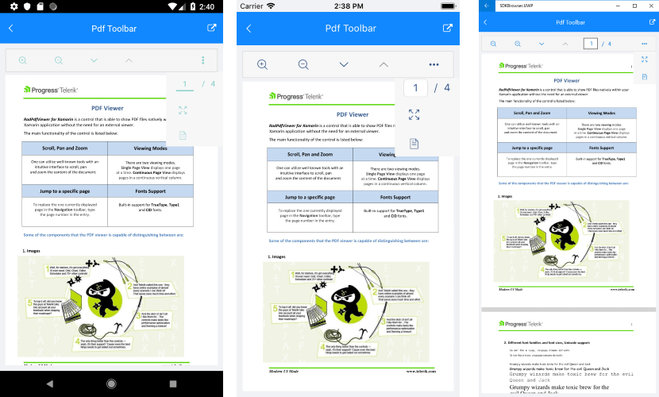
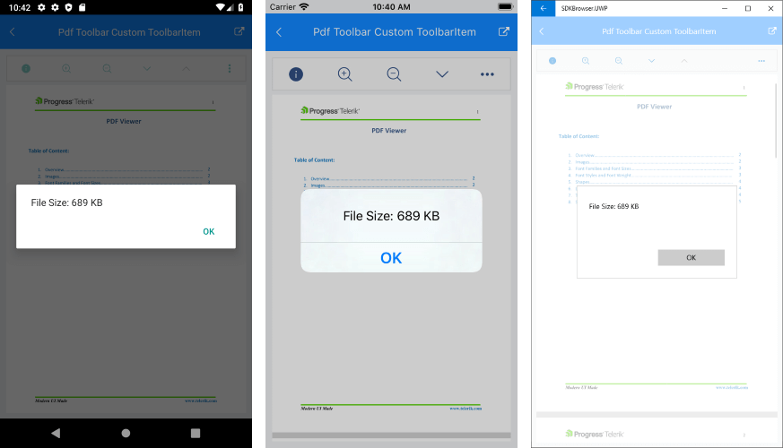

# PdfViewer Toolbar

RadPdfToolbar includes all commands that the RadPdfViewer provides. They can be used as a pre-defined UI toolbar items. You have also the option to include additional toolbar items to the PdfViewerToolbar with a custom command.  

## Predefined Toolbar Items

RadPdfToolbar contains the following Toolbar items:

* **ZoomInToolbarItem**
* **ZoomOutToolbarItem**
* **NavigateToNextPageToolbarItem**
* **NavigateToPreviousPageToolbarItem**
* **NavigateToPageToolbarItem**
* **FitToWidthToolbarItem**
* **ToggleLayoutModeToolbarItem**

### Example

Here is an example how to use the RadPdfViewer Toolbar:

Use the following snippet to define the RadPdfViewer and RadPdfToolbar:

<snippet id='pdfviewer-toolbar-xaml'/>

In addition to this, you need to add the following namespace:

```XAML
xmlns:telerikPdfViewer="clr-namespace:Telerik.XamarinForms.PdfViewer;assembly=Telerik.XamarinForms.PdfViewer"
```

Then add the following code to visualize the pdf document:

<snippet id='pdfviewer-toolbar'/>

This is the result:



## Custom Toolbar Item

You can easily add custom toolbar items to the PdfToolbar bound with a custom command. This is implemented by creating a **PdfViewerToolbarItemBase** object with **Text** and **Command** properties applied and adding it to the PdfViewerToolbar Items collection.

Below you can find an example showing how to add a custom ToolbarItem with a sample command bound to it. The command is used just to display a message with the PdfDocument file size.

First, add the PdfViewer and the PdfToolbar controls to your page:

<snippet id='pdfviewer-toolbar-customcommand-xaml' />

>tip The text of the custom ToolbarItem is set to one of the provided with Telerik UI for Xamarin font icons. For more details on this check [Telerik Font Icons]() topic. 

Then, load a sample pdf document in code-behind:

<snippet id='pdfviewer-toolbar-customcommand' />

As you might notice in the previous snippet, there is a ViewModel class set as BindingContext of the page. In the ViewModel you can get a reference to the **RadFixedDocument** instance through the **Document** property of the PdfViewer as well as execute the DisplayFileSizeCommand bound to the Command property of the custom ToolbarItem:

<snippet id='pdfviewer-toolbar-customcommand-vm' />

Check below the result on different platforms:



>important A sample Custom ToolbarItem example is available in PdfViewer -> Features folder of the [SDK Browser application](#sdk-browser-application).

## See Also

- [Telerik Font Icons]()
- [Commands]()
