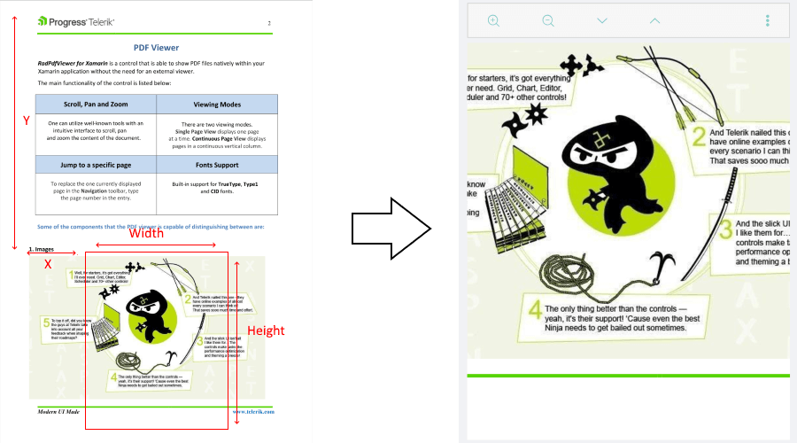

# Viewport Settings

The viewport is the user's visible area of the loaded in the PdfViewer pdf document. The viewport dimension varies according to the screen dimension of the target devices.

As the viewport represents that part of the pdf document that is currently displayed, zooming and scrolling, for example, change the viewport - after these actions a different part of the document is shown. Zooming changes the width and height of the portion of the document, scrolling and panning change the viewport position. 

Now with R2 2020 SP release RadPdfViewer provides a way to access its visible area through the **Viewport** property as well as modify it through **ChangeViewport** method.

The **Viewport** property is of type *Xamarin.Forms.Rectangle* and can be defined through its top left corner at (x, y) position and width and height values out of the overall content size of the pdf document.

The content size of the document depends on the current layout mode of the PDfViewer.  

>tip For detailed information on the available layout modes check [Viewing Modes](#viewing-modes) topic.

#### SinglePage LayoutMode

With SinglePage layout mode RadPdfViewer shows one page at a time, so the content size is the size of that page. The viewport position is calculated relative to the page.



#### ContinuousScroll LayoutMode

With ContinuousScroll layout mode the content size is calculated taking into account all the pages of the document. In this mode the pages are ordered vertically one below another and are horizontally centered (if the document contains pages with different width, some pages will not be at 0 horizontal position). 

The content width is even to the widest page, the content height is calculated as a sum of the heights of all the pages plus a sum of the distances between the pages (the distance between pages is controlled by the <code>PageSpacing</code> property of the PdfViewer).

So, viewport Y position is calculated relative to the content height (all pages' height + distances):


### Example

The example below demonstrates how you can utilize the ChangeViewport method to navigate to the last page of the document in ContinuousScroll layout mode.  The same method is also used to set the zoom level, so that the whole width of the last page is visible in both ContinuousScroll and SinglePage modes.

Use the following snippet to define the RadPdfViewer and RadPdfToolbar:

```XAML
<Grid>
	<Grid.RowDefinitions>
		<RowDefinition Height="Auto"/>
		<RowDefinition />
	</Grid.RowDefinitions>
	<telerikPdfViewer:RadPdfViewerToolbar PdfViewer="{Binding Source={x:Reference pdfViewer}}">
		<telerikPdfViewer:ZoomInToolbarItem />
		<telerikPdfViewer:ZoomOutToolbarItem />
		<telerikPdfViewer:NavigateToNextPageToolbarItem/>
		<telerikPdfViewer:NavigateToPreviousPageToolbarItem/>
		<telerikPdfViewer:NavigateToPageToolbarItem/>
		<telerikPdfViewer:FitToWidthToolbarItem/>
		<telerikPdfViewer:ToggleLayoutModeToolbarItem/>
	</telerikPdfViewer:RadPdfViewerToolbar>
	<telerikPdfViewer:RadPdfViewer x:Name="pdfViewer" Grid.Row="1"/>
</Grid>
```

In addition to this, you need to add the following namespace:

```XAML
xmlns:telerikPdfViewer="clr-namespace:Telerik.XamarinForms.PdfViewer;assembly=Telerik.XamarinForms.PdfViewer"
```

In order to get the current viewport  position and size, use the snippet below:

```C#
var viewport = this.pdfViewer.Viewport;
var viewportMessage = String.Format("Current viewport with Width: {0:0.00}, Height: {1:0.00}, Left: {2:0.00}, Top: {3:0.00}", viewport.Width, viewport.Height, viewport.X, viewport.Y);
Application.Current.MainPage.DisplayAlert("Current Viewport", viewportMessage, "OK");
```

The next snippets demonstrates how you can manipulate the viewport of the PdfViewer:

```C#
RadFixedDocument document = this.pdfViewer.Document;

var lastPageSize = document.Pages[document.Pages.Count - 1].Size;

if (this.pdfViewer.LayoutMode == LayoutMode.ContinuousScroll)
{               
	double pagesHeight = 0;

	for (int i = 0; i < document.Pages.Count - 1; i++)
	{
		pagesHeight += document.Pages[i].Size.Height;
		pagesHeight += this.pdfViewer.PageSpacing;
	}               
	this.pdfViewer.ChangeViewport(new Rectangle(0, pagesHeight, lastPageSize.Width, lastPageSize.Height));
}
else
{
	this.pdfViewer.NavigateToPage(document.Pages.Count - 1);
	this.pdfViewer.ChangeViewport(new Rectangle(0, 0, lastPageSize.Width, lastPageSize.Height));
}
```

## See Also

- [Key Features]()
- [Commands]()
