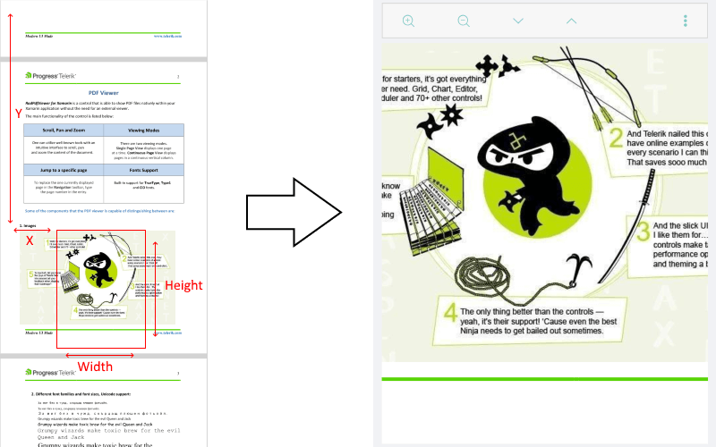

# Viewport Settings

With R2 2020 SP release of Telerik UI for Xamarin RadPdfViewer provides API for getting and manipulating its viewport through the **Viewport** property and **ChangeViewport** method. 

The viewport is the "window" in which the PdfViewer displays its content, users can change the viewport through zooming, panning and scrolling:


In order to explain how the viewport works, first we need to make clear what's the PdfViewer content as well as how to define the content size. The PdfViewer content is the pdf document itself, and more specifically the document pages. RadPdfViewer provides two layout mode (SinglePage or ContinuousScroll) which use different approaches for arranging the document pages. The way the content is defined varies according to the selected layout mode.

>tip For detailed information on the available layout modes check [Viewing Modes](#viewing-modes) topic.

#### SinglePage LayoutMode

With SinglePage layout mode RadPdfViewer shows one page at a time (the pages are stacked), so the content is the current page and the content size is the size of that page. In cases there are pages with different size in the pdf document, the content size is changed accordingly. 

The viewport position is calculated relative to the current page.


#### ContinuousScroll LayoutMode

With ContinuousScroll layout mode, the content refers to all pages of the document. In this mode the pages are ordered vertically one below another with space between them and are horizontally centered (if the document contains pages with different width, some pages will not be at 0 horizontal position). 

The content width is even to the widest page, the content height is calculated as a sum of the heights of all the pages plus a sum of the distances between the pages (the distance between pages is controlled by the <code>PageSpacing</code> property of the PdfViewer).

So, the viewport position is calculated relative to the whole content (all pages + distances):



No matter which layout mode is selected, the viewport is the "window" which moves over the defined content and renders those pdf elements currently positioned in it.

The **Viewport** property of the PdfViewer is of type *Xamarin.Forms.Rectangle* and can be defined by its top left corner at (x, y) position and width and height values. Keep in mind it's possible to have negative X and Y values in case the viewport becomes bigger than the content itself.

### Example

The example below demonstrates how you can utilize the ChangeViewport method to navigate to the last page of the document in ContinuousScroll and SinglePage layout modes as well as how to access the current viewport.

Use the following snippet to define the RadPdfViewer and RadPdfToolbar:

```XAML
<Grid>
	<Grid.RowDefinitions>
		<RowDefinition Height="Auto"/>
		<RowDefinition />
	</Grid.RowDefinitions>
	<telerikPdfViewer:RadPdfViewerToolbar PdfViewer="{Binding Source={x:Reference pdfViewer}}">
		<telerikPdfViewer:ZoomInToolbarItem />
		<telerikPdfViewer:ZoomOutToolbarItem />
		<telerikPdfViewer:NavigateToNextPageToolbarItem/>
		<telerikPdfViewer:NavigateToPreviousPageToolbarItem/>
		<telerikPdfViewer:NavigateToPageToolbarItem/>
		<telerikPdfViewer:FitToWidthToolbarItem/>
		<telerikPdfViewer:ToggleLayoutModeToolbarItem/>
	</telerikPdfViewer:RadPdfViewerToolbar>
	<telerikPdfViewer:RadPdfViewer x:Name="pdfViewer" Grid.Row="1"/>
</Grid>
```

In addition to this, you need to add the following namespace:

```XAML
xmlns:telerikPdfViewer="clr-namespace:Telerik.XamarinForms.PdfViewer;assembly=Telerik.XamarinForms.PdfViewer"
```

In order to get the current viewport  position and size, use the snippet below:

```C#
var viewport = this.pdfViewer.Viewport;
var viewportMessage = String.Format("Current viewport with Width: {0:0.00}, Height: {1:0.00}, Left: {2:0.00}, Top: {3:0.00}", viewport.Width, viewport.Height, viewport.X, viewport.Y);
Application.Current.MainPage.DisplayAlert("Current Viewport", viewportMessage, "OK");
```

The next snippets demonstrates how you can manipulate the viewport of the PdfViewer:

```C#
RadFixedDocument document = this.pdfViewer.Document;
var currentViewport = this.pdfViewer.Viewport;

if (this.pdfViewer.LayoutMode == LayoutMode.ContinuousScroll)
{               
	double pagesHeight = 0;

	for (int i = 0; i < document.Pages.Count - 1; i++)
	{
		pagesHeight += document.Pages[i].Size.Height;
		pagesHeight += this.pdfViewer.PageSpacing;
	}               
	this.pdfViewer.ChangeViewport(new Rectangle(0, pagesHeight, currentViewport.Width, currentViewport.Height));
}
else
{
	this.pdfViewer.NavigateToPage(document.Pages.Count - 1);
	this.pdfViewer.ChangeViewport(new Rectangle(0, 0, currentViewport.Width, currentViewport.Height));
}
```

## See Also

- [Key Features]()
- [Commands]()
