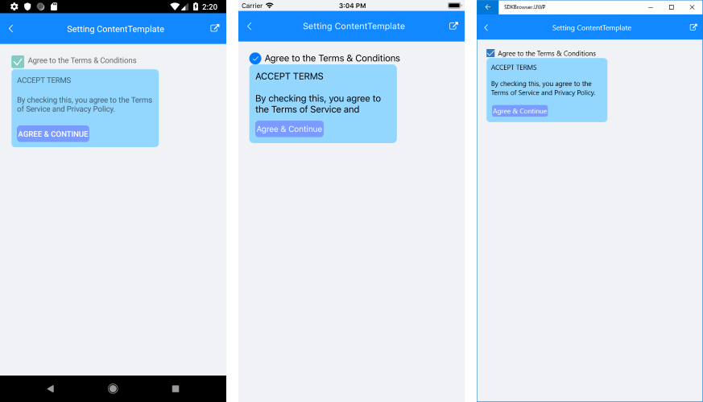
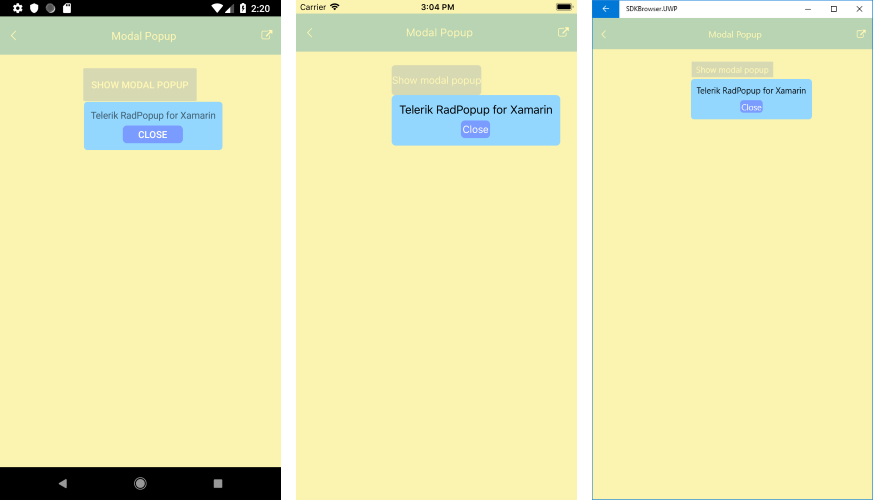
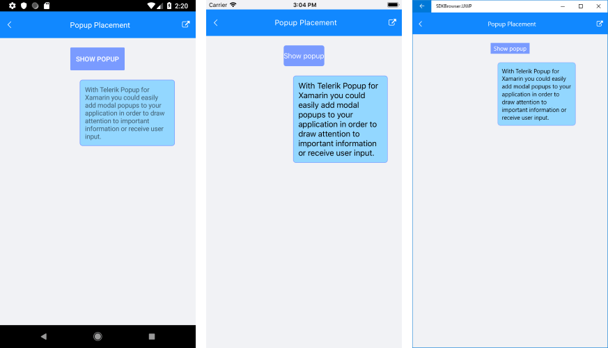

# Key Features

The purpose of this help article is to show you the key features of the **RadPopup** control. 

## Open / Close the popup

In order to show the RadPopup control you would need to set **IsOpen** property to *True*. By default the popup stays open until the **IsOpen** property is set to *False* or the user taps outside in case of not a modal popup.

## Setting Content

To host content inside RadPopup control you can either add it directly as a child element or use the popup’s **ContentTemplate** property.

The example below demonstrates how you could create a sample DataTemplate and set it as RadPopup ContentTemplate.

First, add the needed DataTemplate to the page Resources:

<snippet id='popup-features-contenttemplate-resource' />

Then, when defining the RadPopup control either in XAML or code-behind, apply ContentTemplate property:

<snippet id='popup-features-contenttemplate-xaml' />

Add the events as shown below:

<snippet id='popup-features-contenttemplate-events' />

Here is the result:

## Modal popup

You could define whether the popup will be modal or not through the **IsModal** Boolean property. When **IsModal** is *True*, the UI behind the popup gets inactive and cannot be used until the popup is closed.

## Applying overlay color 

**OutsideBackgroundColor** property lets you customize the color outside the popup. In most cases this is used for modal popups to indicate the user cannot interact with the UI behind. The default value is *Color.Transparent*. 

Below is an example on how you could apply OutsideBackgroundColor to a modal popup.

<snippet id='popup-features-modal' />

And the needed events handlers used to show/hide the popup:

<snippet id='popup-features-modal-events' />

Check the Popup with applied overlay color on different platforms below:

## Placement Configuration

RadPopup provides a few useful properties which will help you position it per your preferences.   

* **PlacementTarget**: Defines an element relative to which the popup is positioned when it is open;
* **Placement**: Specifies the way the popup aligns to its placement target. Placement property is of type *PlacementMode* and can be set to any of the Top, Right, Left, Bottom, Center or Relative options where:
	* Top, Right, Left, Bottom: aligns the popup control to the corresponding corner of the placement target;
	* Center: aligns the popup at the middle of the PlacementTarget;
	* Relative: a position that aligns the top left corner of the popup with the top left corner of the placement target.
	
* **HorizontalOffset / VerticalOffset**: Specifies the horizontal/vertical distance between the placement target and the alignment point.  

<snippet id='popup-features-placement' />

Note that in the example RadPopup is defined inline through *RadPopup.Popup* attached property applied to the Button control, so the Button is considered as PlacementTarget of RadPopup.

Here is the result:

>tip If you need to center the popup when it is declared in XAML, attach it to the Page element and set its Placement property to "Center".

## Animation Settings

RadPopup provides two built-in animations played when the popup is shown/hidden. You could apply the animation through **AnimationType** property which exposes the following options:

* None (use it to disable the animation)
* Fade
* Zoom

The default AnimationType is _Fade_.

You could also customize the duration and easing (acceleration over time) through **AnimationDuration** (in ms) and **AnimationEasing** (of type *Xamarin.Forms.Easing*) properties. The default duration is 300ms and the default easing is _Easing.Linear_.

## See Also

- [Getting Started]()
