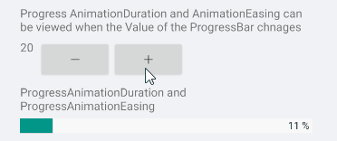
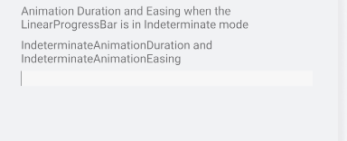

# Animations

ProgressBar for Xamarin allows you to apply dfferent animation easing while changing its `Value` and an animation while in **Indeterminate mode**. In addition you can change the animation duration. 

## Animation during progress change

Customize the animation duration and easing through `ProgressAnimationDuration` and `ProgressAnimationEasing` properties.

* `ProgressAnimationDuration`(`int`): Defines the duration of the animation while control's value changes. The default calue is `800`.
* `ProgressAnimationEasing`(`Xamarin.Forms.Easing)`): Specifies animation acceleration over time. The default value is `Easing.Linear`.

**Example with ProgressAnimationDuration and ProgressAnimationEasing**

The snippet below shows a simple `RadLinearProgressBar` definition. The PrgressBar `Value` changes when using the Stepper control. The animation occurs when the control `Value` changes.

<snippet id='progressbar-progress-animation-duration-easing'/>

In addition to this, you need to add the following namespace:

<snippet id='xmlns-telerikprimitives'/>

Here is the result:

## Animation when Indeterminate Mode 

Customize the indeterminate animation duration and easing through `IndeterminateAnimationDuration` and `IndeterminateAnimationEasing` properties.

* `IndeterminateAnimationDuration`(`int`): Defines the duration of the animation while in Indeterminate mode. The default calue is `800`.
* `IndeterminateAnimationEasing`(`Xamarin.Forms.Easing)`): Specifies animation acceleration over time. The default value is `Easing.Linear`.

**Example with IndeterminateAnimationDuration and IndeterminateAnimationEasing**

The snippet below shows a simple `RadLinearProgressBar` definition:

<snippet id='progressbar-indeterminate-animation-duration-easing'/>

In addition to this, you need to add the following namespace:

<snippet id='xmlns-telerikprimitives'/>

Here is the result:

>important A sample Animation example can be found in the ProgressBar/Features folder of the [SDK Samples Browser application]().

## See Also

- [Configuration]()
- [Indeterminate Mode]()
- [Events]()
- [Styling]()
