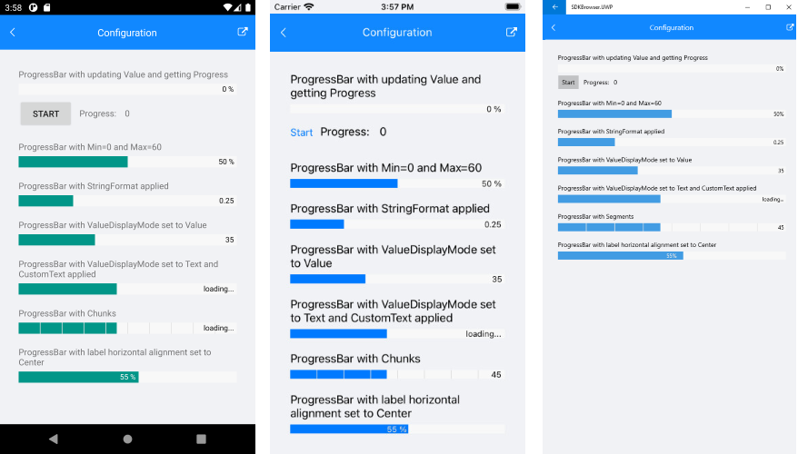

# Configuration

This article will explain all configuration options that ProgressBar control provides.

## Value and Progress

The ProgressBar exposes `Value` and `Progress` properties which are used to set and report, respectively, the progress of a task inside the ProgressBar control.

* `Value`&mdash;Sets the value of the ProgressBar. When `Value` property is updated, this initiates the progress animation of the progress bar.
* `Progress`&mdash;Reports the current progress of the ProgressBar. `Progress` property is updated internally after `Value` is updated and progress animation is complete. It can be used to display the current progress either through `CustomText` property or in external UI.

Here is a quick example showing how you can update `Value` and get the `Progress`:

<snippet id='progressbar-configuration-value'/>

And the ProgressBarStartClicked event handler:

<snippet id='progressbar-configuration-valueupdated'/>

## Value Range

`Minimum` and `Minimum` properties are used to set the minimum and maximum values that the ProgressBar can display.

* `Minimum`&mdash;Specifies the lower limit of the `Value` property, by default its value is 0.
* `Maximum`&mdash;Defines the upper limit of the `Value` property, default value is 100.

You can define `Minimum` and `Maximum` properties of the ProgressBar as shown below:

<snippet id='progressbar-configuration-minmax'/>

## String Format

The `StringFormat`(`string`) specifies the string format applied to the numeric value showing the progress. You can find detailed information about the supported numeric formats in the [Standard Numeric Format Strings](https://docs.microsoft.com/en-us/dotnet/standard/base-types/standard-numeric-format-strings) Microsoft documentation.

<snippet id='progressbar-configuration-stringformat'/>

## Value DisplayMode

`ValueDisplayMode` property of enum type `Telerik.XamarinForms.Primitives.ProgressBar.ValueDisplayMode` can be set to any of the following values:

* (default) Percent&mdash;Displays the progress status in percentage.
* Value&mdash;Displays the progress status as an absolute value.
* Text&mdash;Shows custom text inside the progress bar label. You would need to combine it with `CustomText` property of the ProgressBar.
* None&mdash; No text is shown inside the progress bar.

Here is a quick example with `ValueDisplayMode` set to `Value`:

<snippet id='progressbar-configuration-valuedisplaymode'/>

You can also use `ValueDisplayMode` set to `Text` together with `CustomText`:

<snippet id='progressbar-configuration-customtext'/>

## Segments

Divide the ProgressBar in segments using the `SegmentCount`(`int`) property.

<snippet id='progressbar-configuration-segments'/>

## Label Alignment

The ProgressBar exposes `LabelHorizontalOptions` property of type `Xamarin.Forms.LayoutOptions` which defines the horizontal alignment of the label showing the progress. By default `LabelHorizontalOptions` is `LayoutOptions.End`.

<snippet id='progressbar-configuration-labelalignment' />

>important A sample Configuration example can be found in the ProgressBar/Features folder of the [SDK Samples Browser application]().

Here is how the Configuration example looks:

## See Also

- [Animations]()
- [Indeterminate Mode]()
- [Events]()
- [Styling]()