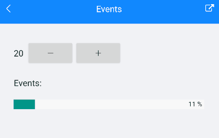

# Events

The ProgressBar for Xamarin exposes the following events:

* `ProgressChanged` event is raised when progress is changed. The `ProgressChanged` event handler receives two paraeters:

	* `sender` of type Telerik.XaarinForms.Primitives.LinearProgressView.
	* A `ProgressChangedEventArgs` which has a reference to the `Progress`(`double`) property.

* `ProgressCompleted` event is raised when the Value of the ProgressBar reaches the `Maximum` value.

**Example with ProgressChanged and ProgressCompleted**

The snippet below shows a simple `RadLinearProgressBar` definition:

<snippet id='progressbar-events'/>

In addition to this, you need to add the following namespace:

<snippet id='xmlns-telerikprimitives'/>

**ProgressChanged** event in code behind. The Label text is updated with the current `Progress` value:

<snippet id='progressbar-progresschanged-event'/>

**ProgressCompleted** event in code behind. The Label text is updated with `Text = "Completed"` when the progress reaches the `Maximum` value:

<snippet id='progressbar-progresscompleted-event'/>

Te final result when using the `ProgressChanged` and `ProgressCompleted` events:

>important A sample Events example can be found in the ProgressBar/Events folder of the [SDK Samples Browser application]().

## See Also

- [Configuration]()
- [Indeterminate Mode]()
- [Styling]()
