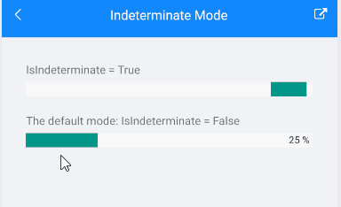

# Indeterminate Mode

Telerik ProgressBar for Xamarin supports two modes of operation:

* **Determinate** - aimed at scenarios in which the progress of an operation can be precisely measured.

* **Indeterminate** - aimed at scenarios in which there is no way of determining the current progress of an operation.

Using the `IsIndeterminate` property(of type `bool`) you can specify whether the control is in Indeterminate mode or not. The default value is `false`.

**Example with Indeterminate mode**

The snippet below shows a simple `RadLinearProgressBar` definition with `IsIndeterminate` property set to `True`.

<snippet id='progressbar-indeterminate-mode'/>

In addition to this, you need to add the following namespace:

<snippet id='xmlns-telerikprimitives'/>

>important A sample Indeterminate Mode example can be found in the ProgressBar/Features folder of the [SDK Samples Browser application]().

## See Also

- [Configuration]()
- [Animations]()
- [Events]()
- [Styling]()