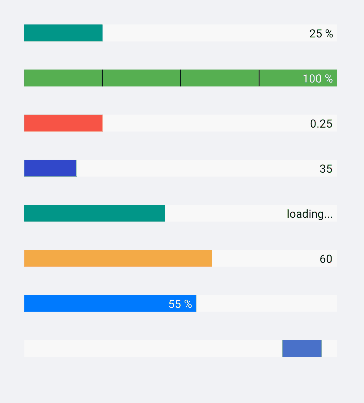

# Overview

**Telerik ProgressBar for Xamarin** is designed to display progress information to the users during a long-running operation. With the ProgressBar you can track the progress of various tasks. The control has an indeterminate mode and segments support. In addition you can customize it using the Flexible Styling API.  

## Key Features

* [Value and Progress](#value-and-progress) features are used to set and report the progress of a task inside the PrgressBar control.
* [Value range](#value-range): Define value ranges by setting the minimum and maximum values.
* [Different value display modes](#value-displaymode): The label that shows the current state of the progress can be set to absolute value, percent, text or fully hidden.
* [Segments support](#segments): The ProgressBar can be divided in segments.
* Render a [custom text]() when `ValueDisplayMode` is set to `Text`.
* [Indeterminate mode support](): A mode that displays an animation indicating an unspecified amount of waiting time.
* [Different animations]([%slug progressbar-animations%]): Apply different animation and animation duration while changing the value of the ProgressBar.
* [Events]() for tracking when the progress progress changes and completion.  
* [Flexible styling API]() for customizing the progress fill, track fill, indeterminate fill, label text color, font size and more.

## See Also

- [Getting Started with ProgressBar for Xamarin]()
