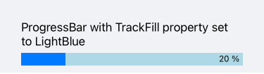
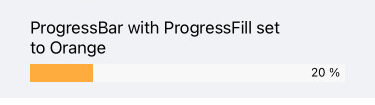
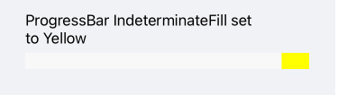
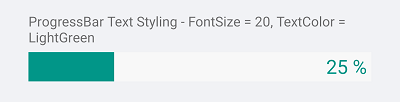
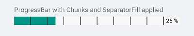

# Styling

The ProgressBar control for Xamarin provides styling options for customizing its appearance.

The control supports the following styling properties:

* `TrackFill`(`Brush`): Specifies the fill of the track.

<snippet id='progressbar-styling-trackfill'/>

* `ProgressFill`(`Brush`): Specifies the fill of the progress indicator.

<snippet id='progressbar-styling-progressfill'/>

* `IndeterminateFill`(`Brush`): Defines the fill of the indeterminate indicator.

<snippet id='progressbar-styling-indeterminatefill'/>

The following Style properties are related to the text displayed in the ProgressBar:

* `TextColor`(`Color`): Defines the color of the Text which displays the progress value.
* `AlternateTextColor`(`Color`)
* `FontSize`(`double`): Defines the font size of the Text which displays the progress value

<snippet id='progressbar-styling-text'/>

Style the ProgressBar segments using the following properties:

* `SegmentSeparatorFill`(`Brush`): Specifies the fill of the segments separators.
* `SegmentSeparatorThickness`(`double`): Sets the thickness of the segments separators.

<snippet id='progressbar-styling-separator-segments'/>

>important A sample Styling example can be found in the ProgressBar/Styling folder of the [SDK Samples Browser application]().

## See Also

- [Configuration]()
- [Indeterminate Mode]()
- [Events]()
