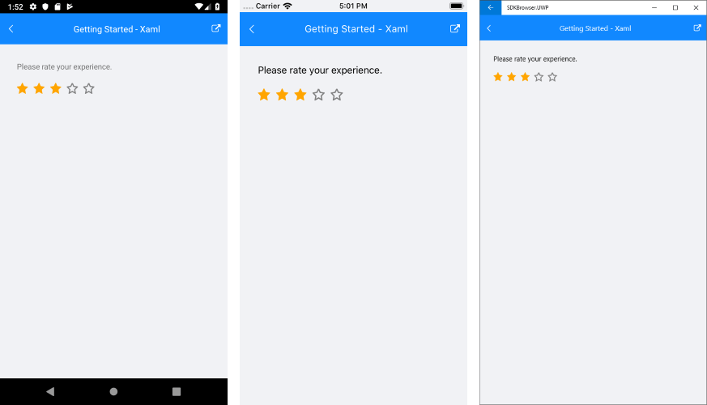

# Getting Started

This example will guide you through the steps needed to add a basic **RadRating** control in your application.

* [Setting up the app](#1-setting-up-the-app)
* [Adding the required Telerik references](#2-adding-the-required-telerik-references)
* [Adding RadRating control](#3-adding-radrating-control)

## 1. Setting up the app

Take a look at these articles and follow the instructions to setup your app:

- [Setup app with Telerik UI for Xamarin on Windows]()
- [Setup app with Telerik UI for Xamarin on Mac]()

## 2. Adding the required Telerik references

You have two options:

* Add the Telerik UI for Xamarin Nuget packages following the instructions in [Telerik NuGet package server]() topic.

* Add the references to Telerik assemblies manually, check the list below with the required assemblies for **RadRating** component:

| Platform | Assemblies |
| -------- | ---------- |
| Portable | Telerik.XamarinForms.Common.dll   Telerik.XamarinForms.Input.dll   Telerik.XamarinForms.SkiaSharp.dll |
| Android  | Telerik.Xamarin.Android.Common.dll   Telerik.Xamarin.Android.Data.dll   Telerik.Xamarin.Android.Input.dll   Telerik.Xamarin.Android.List.dll   Telerik.Xamarin.Android.Primitives.dll   Telerik.XamarinForms.Common.dll   Telerik.XamarinForms.Input.dll   Telerik.XamarinForms.SkiaSharp.dll |
| iOS      | Telerik.XamarinForms.Common.dll   Telerik.XamarinForms.Input.dll   Telerik.XamarinForms.SkiaSharp.dll |
| UWP      | Telerik.XamarinForms.Common.dll   Telerik.XamarinForms.Input.dll   Telerik.XamarinForms.SkiaSharp.dll |

>important RadRating is rendered via the **SkiaSharp** graphics library so you need to install also [SkiaSharp.Views.Forms](https://www.nuget.org/packages/SkiaSharp.Views.Forms) in all projects of the Xamarin solution (.Net Standard/Shared, Android, iOS, etc). 

## 3. Adding RadRating control

If your app is correctly set, you are ready to add a **RadRating** control within your page.  

The simplest and fastest way to include the control is by simply defining it like this in XAML / code-behind:

<snippet id='rating-gettingstarted-xaml'/>
<snippet id='rating-gettingstarted-csharp'/>

In addition to this you need to add the following namespace:

<snippet id='xmlns-telerikinput'/>
<snippet id='ns-telerikinput'/>

By default the control is defined in a way that five stars will be visualized and none of them will be selected. The screenshot below shows the control with selection applied:

>important **SDK Browser** and **QSF** applications contain different examples that show RadRating's main features. You can find the applications in the **Examples** and **QSF** folders of your local **Telerik UI for Xamarin** installation.

## See Also

- [Key Features]()