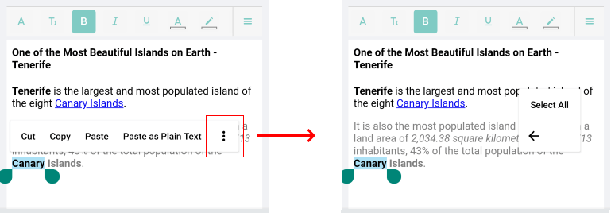
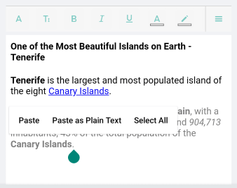
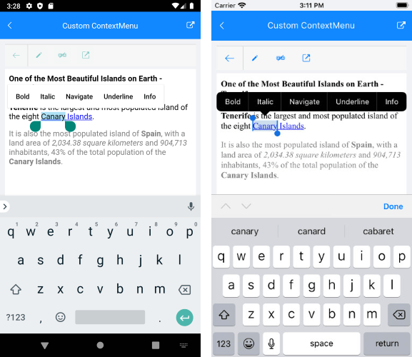

# Context Menu

With R1 2021 release RichTextEditor comes with a built-in context menu support which shows common operations such as Copy and Paste for sharing data between the apps or within the app. The context menu is triggered on tap and hold gesture (right-button click on UWP) over the editor content. On Android and iOS it is also displayed as soon as the user performs selection.

The default context menu shows the following options:

* **Cut** - cuts the selected content and saves it in the system clipboard;
* **Copy** - copies the selected content and saves it in the clipboard;
* **Paste** - pastes the content from the clipboard into the editor;
* **Paste as Plain Text** - pastes the content from the clipboard stripping any additional formatting;
* **Select All** - selects all of the content in the editor;

What options are available in the context menu depends on the current content selection or caret position in the editor.

Check below a few examples of the RichTextEditor Context Menu.

* in case of content selection, all the default options are available:



* in case the context menu is shown over the current caret position (through tap and hold gesture on empty space inside the editor), only **Paste**, **Paste as Plan Text** and **Select All** options are available:



## Custom Context Menu

You can easily modify the RichTextEditor default Context Menu and add or remove some of the provided options. Just need to set <code>AutoGenerateContextMenu</code> property of the RichTextEditor to *False* and manually define the ContextMenuItems. You can choose from the predefined ContextMenuItems or create a <code>CustomContextMenuItem</code> instance and define its **Title** and **Command** (the Command can be bound to any of the RadRichTextEditor's [Commands]() or to a custom command). 

Here is a list of the predefined ContextMenuItems:

* BoldContextMenuItem
* CopyContextMenuItem
* CutContextMenuItem
* ItalicContextMenuItem
* OpenHyperlinkContextMenuItem
* PasteContextMenuItem
* PastePlainTextContextMenuItem
* SelectAllContextMenuItem

Following is an example how the RichTextEditor Context Menu can be customized by using some of the predefined items as well as adding two <code>CustomContextMenuItem</code> instances - the first wired to the RichTextEditor's ToggleUnderlineCommand and the second wired to a custom command imlemented in the ViewModel:

<snippet id='richtexteditor-contextmenu-xaml' />

Add the required namespace:

```XAML
xmlns:telerikRichTextEditor="clr-namespace:Telerik.XamarinForms.RichTextEditor;assembly=Telerik.XamarinForms.RichTextEditor"
```

Add the ViewModel class with the CustomInfoCommand:

<snippet id='richtexteditor-contextmenu-vm' />

And set it as a BindingContext of the page:

<snippet id='richtexteditor-contextmenu-setvm' />

Here is the result:



>important A sample CustomContextMenu example can be found in the RichTextEditor/Features folder of the [SDK Samples Browser application]().

## See Also

- [Commands]()
- [RadRichTextEditor Toolbar]()
