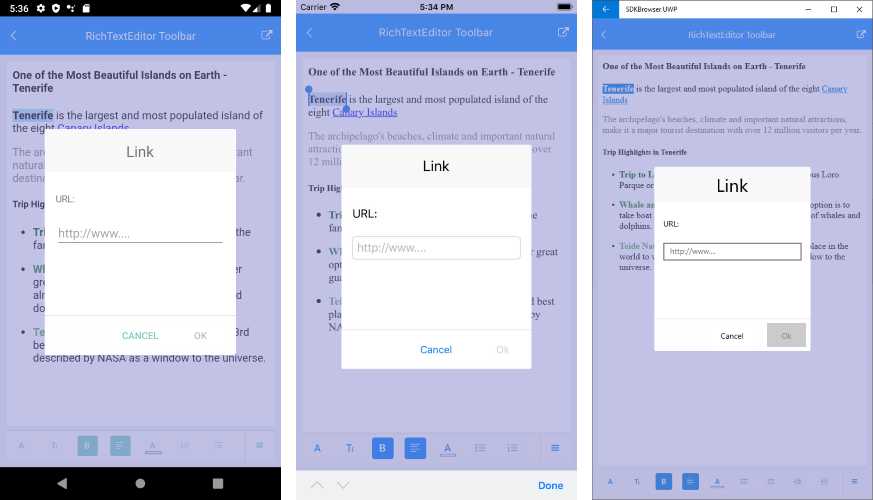

# RichTextEditor Custom Toolbar

By default the RadRichTextEditorToolbar Items are auto-populated. You could change this by setting the RadRichTextEditorToolbar boolean <code>AutoGenerateItems</code> property to False. In this case you will need to manually define and arrange the toolbar items per your needs.

## RichTextEditor ToolbarItem

All predefined toolbar items derive from a common <code>RichTextEditorToolbarItem</code> which exposes some useful configuration as well as styling properties, such as:

* **Text** and **Description** - when the toolbar is placed inside the main toolbar area only the Text is shown, but when in the menu area – both Text and Description are shown.

* **IsOverflowItem** (*bool*): Identifies a toolbar item as an OverflowButton. In case you'd like to add some toolbar items inside additional area that can be open from an overflow button, create a <code>RichTextEditorToolbarItem</code> instance, set its IsOverflowItem to *True* and add toolbar items to it.
 
* **IsChecked** (*bool*): Indicates whether the toolbar item is checked; more toolbar items can be checked at the same time, for example, both ItalicToolbarItem and BoldToolbarItem can be checked;

* **IsSelected** (*bool*): Indicates whether the toolbar item is selected, only one toolbar item can be selected at a time;

## Predefined Toolbar Items

RadRichTextEditorToolbar contains a bunch of predefined toolbar items used to execute the editing features over the content. Below you will find a complete list of the predefined toolbar items grouped according to their type:

- Checkable Toolbar items - these items remain checked and apply the formatting over the text under the caret or the selected text:
	* AlignCenterToolbarItem
	* AlignJustifyToolbarItem
	* AlignLeftToolbarItem
	* AlignRightToolbarItem
	* BoldToolbarItem
	* BulletingToolbarItem
	* ItalicToolbarItem
	* NumberingToolbarItem
	* StrikethroughToolbarItem
	* SubscriptToolbarItem
	* SuperscriptToolbarItem
	* UnderlineToolbarItem
	
- Action Toolbar items - execute the concrete action over the current position or selection:
	* ClearFormattingToolbarItem
	* IndentToolbarItem
	* OutdentToolbarItem
	* RedoToolbarItem
	* UndoToolbarItem
	* CutToolbarItem
	* CopyToolbarItem
	* PastePlainTextToolbarItem
	
- Picker Toolbar items - open picker controls for choosing color, font, etc and apply it at the current position or selection:
	* ColorPickerToolbarItem
	* FontFamilyToolbarItem
	* FontSizeToolbarItem
	* HighlightTextColorToolbarItem
	* TextColorToolbarItem
	* TextFormattingToolbarItem
	
Check below how the ColorPickerToolbarItem, for example, looks when the picker is open:

	
- Hyperlink Toolbar item - toolbar item for managing hyperlinks:
	* AddHyperlinkToolbarItem  - used to create hyperlinks; in addition contains child toolbar items for editing, removing and opening hyperlinks, namely EditHyperlinkToolbarItem, RemoveHyperlinkToolbarItem and OpenHyperlinkToolbarItem;
	
In order to create hyperlinks, users need to select text and use the **AddHyperlinkToolbarItem** - a popup with a field for entering URL will be displayed:

If the caret is over an existing hyperlink, tapping on the **AddHyperlinkToolbarItem** will replace the current toolbar items with the AddHyperlinkToolbarItem child items:

BackButton is shown inside the RichTextEditorToolbar whenever there is a RichTextEditorToolbarItem with nested toolbar items to provide a way to return to the main toolbar. 

OpenHyperlink toolbar item opens a browser and navigates to the respective URL address.

- Add Image Toolbar item - toolbar item for adding images:
	* AddImageToolbarItem: used for adding images. 

- EditImage Toolbar item
	* EditImageToolbarItem: used for image resizing. In addition the toolbar allows you to pick an image if you haven't selected one. 
	
- RemoveImage Toolbar item
	* RemoveImageToolbarItem: used for removing the currently selected image from the editor.
	
For more details review [Insert and Edit Images]() article.

## Example

If you'd like to choose what toolbar items to be shown inside the toolbar as well as their order and arrangement, you would need to set **AutoGenerateItems** to *False* and add the items manually:

<snippet id='richtexteditor-toolbar-xaml' />

And here is the result:

## See Also

- [Key Features]()
- [Commands]()
