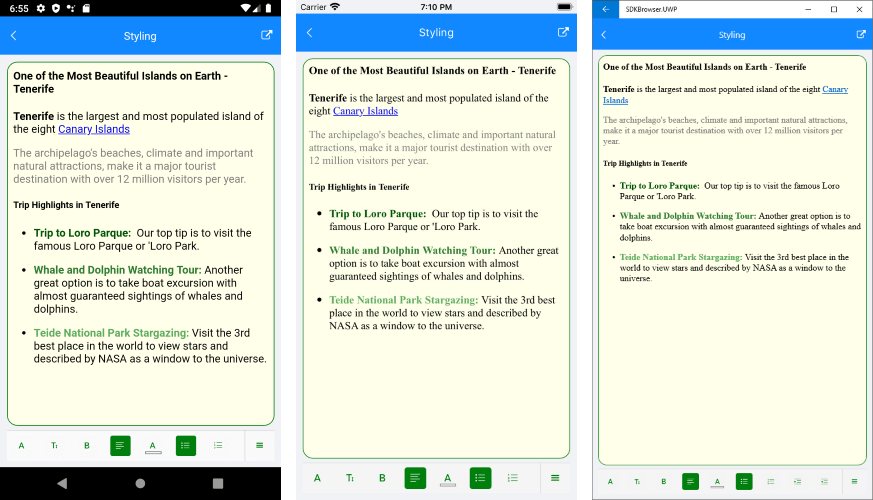

# RichTextEditor Styling

RadRichTextEditor provides means for modifying its visual appearance, so that it matches the style of the app. 

You can take advantage of the following styling properties:

* **BackgroundColor**(*Color*): Specifies background color of the editor area.
* **BorderColor**(*Color*): Defines the border color around the editor.
* **BorderThickness**(*Thickness*): Defines the border thickness around the editor.
* **CornerRadius** (Thickness): Defines corner radius of the border.

## Example

Here is a quick example how you can apply the listed properties:

<snippet id='richtexteditor-styling-xaml' />

This is the result:

## See Also

- [RichTextEditor Toolbar Styling]()
- [Custom Toolbar]()