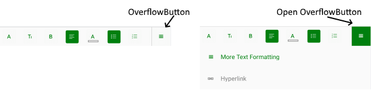
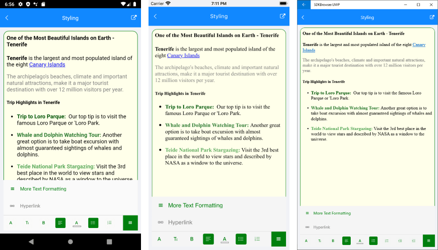

## RichTextEditor Toolbar Styling

Through the provided flexible styling API you can completely customize the lоок &amp; feel of the RichTextEditor Toolbar and its toolbar items, so that the toolbar matches the style of your app.

RadRichTextEditorToolbar exposes the following styling properties:

* **ItemSpacing**(*double*): Specifies the extra spacing between items horizontal direction. The default value is 4.
* **BackgroundColor**: Defines the background color of the toolbar;
* **BorderThickness** and **BorderColor**: Set the toolbar border styling;

To customize the OverflowButton used to open additional menu area, use the following properties of RadRichTextEditorToolbar:

* **OverflowButtonText**
* **OverflowButtonTextColor**
* **OverflowButtonBorderColor**
* **OverflowButtonBorderThickness**
* **OverflowButtonFontFamily**
* **OverflowButtonTemplate**(*DataTemplate*): Specifies the template of the overflow button;
* **OpenOverflowButtonTextColor**: Specifies the text color of the overflow button when it is tapped and the additional menu area is shown;
* **OpenOverflowButtonBackgroundColor**: Sets the background color of the overflow button when it is tapped and the menu area is shown.
* **OverflowPopupBackgroundColor**: Defines the background color of the menu area that is shown when the overflow button is tapped;

Here is a screenshot showing styled OverflowButton:



RadRichTextEditorToolbar provides the option to create a <code>RichTextEditorToolbarItem</code> with nested toolbar items - in this case tapping on the RichTextEditorToolbarItem will replace the current toolbar items with its nested toolbar items. In addition, there is a BackButton added on the left to provide easy access to the main toolbar. You can customize the BackButton through the following properties of the RichTextEditorToolbar:

* **BackButtonFontFamily**
* **BackButtonTextColor**
* **BackButtonText**

Check below an example of toolbar item with nested items and BackButton:


## RichTextEditor Toolbar Items Styling

RichTextEditorToolbarItem exposes the following styling properties:

* **TextColor**, **CheckedColor**, **SelectedColor**: Define the toolbar item text color according to the item state;
* **BackgroundColor**, **CheckedBackgroundColor** and **SelectedBackgroundColor**: Define the toolbar item background color according to the item state;
* Font settings - **FontSize**, **FontFamily** and **FontAttributes**;

You can also customize the **PickerToolbarItems** used in the toolbar such as ColorPickerToolbarItem, FontFamilyToolbarItem, etc.  PickerToolbarItem provides the following styling properties:

* **ItemStyle** and **SelectedItemStyle**: Modify the picker items' style in regular and selected state, accordingly. You would need to use **telerikDataControls:NonVirtualizedItemsControlItemContainer** as the TargetType of the ItemStyle properties;
* **PopupContentSyle** and **PopupContentHeight**: Allow you to customize the popup that is displayed when tapping on a PickerToolbarItem. The TargetType of PopupContentSyle should be **telerikRichTextEditor:PopupContentView**.


## Example

You will need to declare Styles in the ResourceDictionary of the page and set TargetType properties to be of type **telerikRichTextEditor:RadRichTextEditorToolbar** for the toolbar and **telerikRichTextEditor:RichTextEditorToolbarItem** - for the items.

>note In order to apply the style to all toolbar items you should set the *Style.ApplyToDerivedTypes* property to *True*. In this way each style with target type <code>RichTextEditorToolbarItem</code> will affect the predefined toolbar items.

The example below shows how you can customize the RichTextEditorToolbar as well as the RichTextEditorToolbarItems. 

First, let's add the RichTextEditorToolbar definition:

<snippet id='richtexteditor-styling-toolbar-xaml' />

Then add the Styles in the Resources of the page :

<snippet id='richtexteditor-styling-styles-xaml' />

In addition to this, you need to add the following namespace:

```XAML
xmlns:telerikRichTextEditor="clr-namespace:Telerik.XamarinForms.RichTextEditor;assembly=Telerik.XamarinForms.RichTextEditor"
xmlns:telerikDataControls="clr-namespace:Telerik.XamarinForms.DataControls;assembly=Telerik.XamarinForms.DataControls"
```

This is the result:



## See Also

- [RichTextEditor Styling]()
- [Custom Toolbar]()