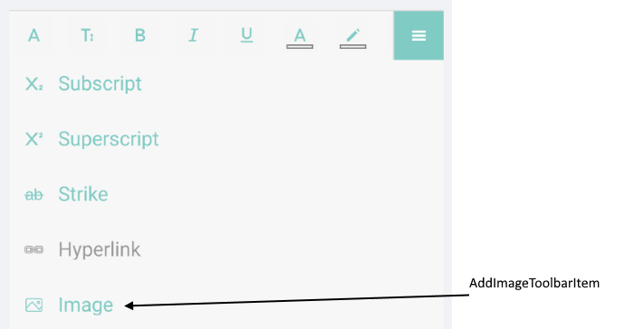
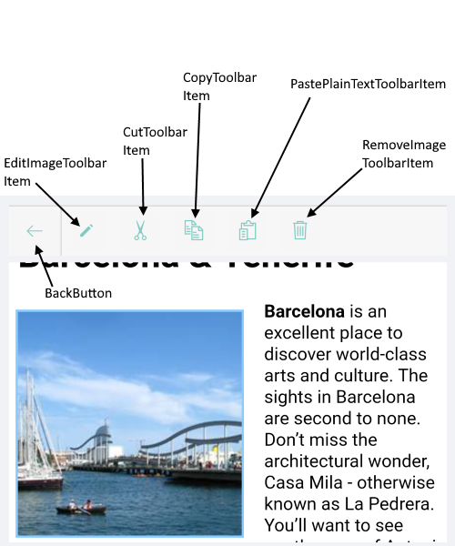
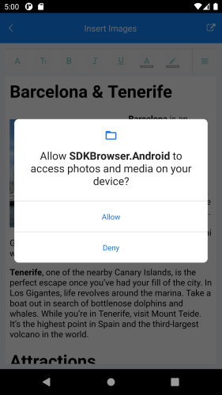

# Overview

From R3 2021 release of Telerik UI for Xamarin the RichTextEditor control allows you to add(insert), cut, copy, paste, resize and delete images using built-in toolbar items. 

 


* `AddImageToolbarItem`(*RichTextEditorToolbarItem*): allows you to add an image - the RichTextEditor `PickImage` event is fired, so you can handle the logic for selecting an image.
* `EditImageToolbarItem`(*InsertImageToolbarItem*): allows you to resize the image. In addition the toolbar allows you to pick an image (the RichTextEditor.`PickImage` event is fired) if you haven't selected one. Check [Edit Image ToolbarItem](#edit-image-toolbaritem) for more details.
* `CutToolbarItem`(*RichTextEditorToolbarItem*): allows you to cut the selected HTML/image from the clipboard.
* `CopyToolbarItem`(*RichTextEditorToolbarItem*): allows you to copy the selected HTML to the clipboard. 
* `PasteHtmlToolbarItem`(*RichTextEditorToolbarItem*): allows you to paste HTML from the clipboard.
* `RemoveImageToolbarItem`(*RichTextEditorToolbarItem*): allows you to remove/delete the currently selected image.

You can insert images from Uri, Data(byte []), Stream, File. The image source is of type `RichTextImageSource`. 

* `RichTextImageSource FromData(byte[] data, RichTextImageType type)`
* `RichTextImageSource FromFile(string path)`
* `RichTextImageSource FromFile(string path, RichTextImageType type)`
* `RichTextImageSource FromStream(Stream stream, RichTextImageType type)`
* `RichTextImageSource FromStream(Func<Stream> stream, RichTextImageType type)`
* `RichTextImageSource FromStream(Func<Task<Stream>> stream, RichTextImageType type)`
* `RichTextImageSource FromStream(Func<CancellationToken, Task<Stream>> stream, RichTextImageType type)`
* `RichTextImageSource FromUrl(string uri)`


Also you have to point out the image format type. The supported image format types(of type `RichTextImageType`) are:

* **Gif**
* **Jpeg**
* **Png**
* **Svg**
* **Webp**

## Permissions if adding images from gallery

>important If you want to work with images from the device gallery, then you have to grant permissions. Check below for more details about the needed permissions per platform.

Add images using the predefined toolbar items - `AddImageToolbarItem` and `EditImageToolbarItem`. Both toolbar items provide a way to pick an image - with `AddImageToolbarItem` directly, while with `EditImageToolbarItem` users have the option to select a new image from the additional dialog (go to [Edit Image ToolbarItem](#edit-image-toolbaritem) for more details) - in both cases the RichTextEditor `PickImage` event is fired. You need to manually implement the logic for selecting an image inside the PickImage event handler. 

Check below a sample implementation of handling the PickImage event and providing the option for the end user to select an image from the device gallery.

The RichTextEditor definition in XAML and the Toolbar definition:

<snippet id='rte-insert-images' />

The PickImage event handler with implementation to get permissions to access photos and media on the device:

<snippet id='rte-insert-images-pick-image-implementation' />

The PermissionHelper class definition:

<snippet id='rte-insert-images-pick-image-permissionhelper' />

The **Plugin.Permission** NuGet package is requred.

Load HTML file:

<snippet id='rte-insert-images-add-rte-source' />



The demo uses the **Xam.Plugin.Media** nuget package for all projects - .NET Standard, Android, iOS, UWP. In addition for .NET Standard and Android projects - **Plugin.Permissions** NuGet package is installed. 

### Permissions for Android

In MainActivity.cs inside the OnCreate method initialize the Plugin.Media:

```C#
Plugin.Media.CrossMedia.Current.Initialize();
```

In MainActivity.cs override the `OnRequestPermissionsResult` method

```C#
public override void OnRequestPermissionsResult(int requestCode, string[] permissions, [GeneratedEnum] Permission[] grantResults)
{
    Xamarin.Essentials.Platform.OnRequestPermissionsResult(requestCode, permissions, grantResults);
    Plugin.Permissions.PermissionsImplementation.Current.OnRequestPermissionsResult(requestCode, permissions, grantResults);
    base.OnRequestPermissionsResult(requestCode, permissions, grantResults);
}
```

### Permissions for iOS 

Inside the Info.plist file add the following code to grant permissions to access the device gallery 

```xml
<key>NSPhotoLibraryUsageDescription</key>
<string>This app needs access to photos.</string>
<key>NSPhotoLibraryAddUsageDescription</key>
<string>This app needs access to the photo gallery.</string>
```

## Events 

* **PickImage**: Raised when the user has requested to pick an image in the RadRichTextEditor. The PickImage event handler receives two parameters:
	* The `sender` which is the RichTextEditor control;
	* `PickImageEventArgs` provides the following methods:
		* `Accept` - Invoke this method when the user has picked an image. Recieves one paramerter `imagesource` of type RichTextImageSource (Specifies the RichTextImageSource for the picked image);
		* `Cancel` - Invoke this method when the user has cancelled the operation;

* **InsertImageError**: Raised when trying to insert an image in the RadRichTextEditor. The InsertImageError event handler receives two parameters:
	* The `sender` which is the RichTextEditor control;
	* `InsertImageErrorEventArgs` provides the following methods:
		* `Source` - of type RichTextImageSource. The property allows you to get the source of the image (read-only property).
		* `Error` - of type Exception. Specifies the exception that is raised when image cannot be inserted.

* **IsImageSelectedChanged**: Raised when an image inside the editor is selected. The IsImageSelectedChanged event handler receives two parameters:
	* The `sender` which is the RichTextEditor control;
	* `RadValueChangedEventArgs<bool>` provides `NewValue` and `OldValue` properties of type **bool**, indicating the `IsImageSelected` property change.

## Methods

* `GetImageAsync` method returns asynchronously an object of type RichTextImage which represents the current selected image (or null in case there is no image). The RichTextImage object contains the Source, Title, Width and Height of the image;

## Commands

* **InsertImageCommand**(*ICommand*): uses for inserting images in the editor. The command takes a single parameter of type `RichTextImage`. The RichTextImage object contains the source, title, width, height of the image. If you do not set width and height explicitly, the image will be added with its original size. 
* **RemoveImageCommand**(*ICommand*): uses for removing images from the editor.

## See Also

- [Key Features]()
- [RadRichTextEditor Toolbar]()
- [Commands]()
