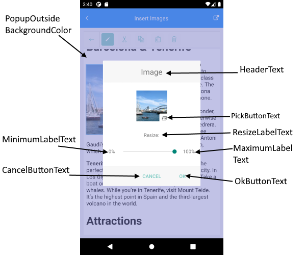
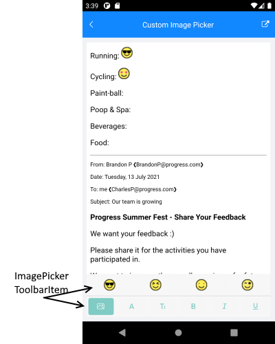

# Toolbar Items for Working With Images

In this article we will review the built-in toolbar items for imsert and edit images.

## Insert Images

* `AddImageToolbarItem`

Default look of the `AddImageToolbarItem`:


## Built-in Toolbar Items for editing images

The following Built-in Toolbar itema are displayed in the RichTextEditorToolbar when image is selected:

* `EditImageToolbarItem`(*InsertImageToolbarItem*): allows you to resize the image. In addition the toolbar allows you to pick an image if you haven't selected one. 
* `CutToolbarItem`(*RichTextEditorToolbarItem*): allows you to cut the selected HTML/image from the clipboard.
* `CopyToolbarItem`(*RichTextEditorToolbarItem*): allows you to copy the selected HTML to the clipboard. 
* `PasteHtmlToolbarItem`(*RichTextEditorToolbarItem*): allows you to paste HTML from the clipboard.
* `RemoveImageToolbarItem`(*RichTextEditorToolbarItem*): allows you to remove/delete the currently selected image.

How the editing toolbar looks when image is selected: 


## Edit Image ToolbarItem

EditImageToolbarItem allows you to resize the image and pick an image. When tapping on the **EditImageToolbarItem**, a dialog is displayed. 

* **Text**(*string*): Defines the Edit Icon Text
* **HeaderText**(*string*): Defines the header text value. Default string `Image`
* **PickButtonText**(*string*): Defines the text of the button that allows you to pick images. Note that `PickImage` event is raised when `PickButton`(of type *Xamarin.Forms.Button*) is pressed. 
* **ResizeLabelText**(*string*): Defines the text of the `Resize` Xamarin.Forms.Label. Default value `Resize:`
* **MinimumLabelText**(*string*): Defines the text of the Minimum Xamarin.Forms.Label. Default value `0%`
* **MaximumLabelText**(*string*): Defines the text of the Maximum Xamarin.Forms.Label. Default value `100%`
* **OkButtonText**(*string*): Defines the text for Ok button. Default value `Ok`
* **CancelButtonText**(*string*): Defines the text for Cancel button. Default value: `Cancel`
* **PopupContentStyle**(*Style*): Defines the Style applied to the popup content.
* **PopupOutsideBackgroundColor**(*Color*): Defines the backgrounf color applied outside of the popup content.
* **PopupContentTemplate**(*ControlTemplate*): Defines  the control template of the popup.



>Insert Images example can be found inside the **SDK Browser App - RichTextEditor/Features folder**

## ImagePickerToolbar Item

* **ImagePickerToolbarItem**(*Telerik.XamarinForms.RichTextEditor.PickerToolbarItem*): Allows you to pick an image from a collection of pre-defined images.



### Example

RichTextEditor Definition in XAML and the Toolbar definition:

<snippet id='richtexteditor-custom-image-picker' />

Add the namespace:

```XAML
xmlns:telerikRichTextEditor="clr-namespace:Telerik.XamarinForms.RichTextEditor;assembly=Telerik.XamarinForms.RichTextEditor"
```

Add Images inside the ImagePickerToolbarItem ItemsSource:

<snippet id='rte-custom-image-picker-add-images-to-picker-toolbar-item' />

Call the InitializeImages inside the page's constructor:

<snippet id='rte-custom-image-picker-initialize-images' />

Set the RichTextEditor Source:

<snippet id='rte-custom-image-picker-html-document' />

> Custom Image Picker example can be found inside the **SDK Browser App - RichTextEditor/Features folder**

## See Also

- [Key Features]()
- [RadRichTextEditor Toolbar]()
- [Commands]()
