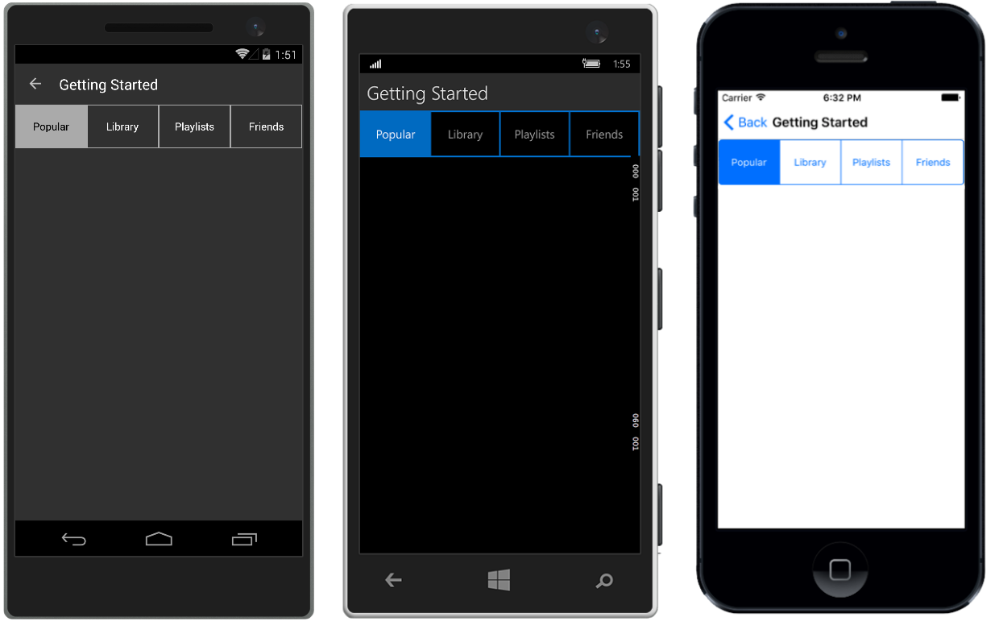

# Overview

**RadSegmentControl** allows you to display a list of horizontally aligned, mutually exclusive options, which can be selected by the user. Each option is a button that can display a text or an image.

> **RadSegmentControl** is available for the following platforms:
> - **Android**
> - **iOS**
> - **Universal Windows Platform**

 

### Key features

- **Easily customizeable items**: The control provides several properties which you can use to customize the background and text color of its segments.
- **Disabling segments**: You can disable the interactions with a specific segment and also set a specific color for this state.
- **Customizable segment colors**: You can customize the colors of the segments in the different states - normal, selected, disabled.

### See Also

- [Project Wizard]()
- [Getting Started]()