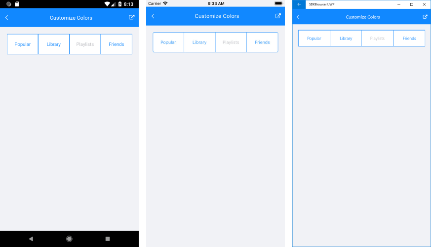

# Customize Segment Colors

**RadSegmentedControl** has several properties which you can use to customize the text and background colors of the segments.

### List of color properties

There are different colors applied to the segments in their different states. The control exposes the following **properties**:

- **SegmentBackgroundColor**: This is the background color applied to the unselected segments.
- **SegmentTextColor**: This is the text color applied to the unselected segments.

- **SelectedSegmentBackgroundColor**: This is the background color applied to the selected segment.
- **SelectedSegmentTextColor**: This is the text color applied to the selected segment.

- **DisabledSegmentTextColor**: This is the text color applied to the disabled segments.

### Example

This example shows setting the different segment colors.

<snippet id='segmentcontrol-features-customizecolors-xaml'/>
<snippet id='segmentcontrol-features-customizecolors-csharp'/>

#### Figure 1: Customized segment colors
 
 

### See Also

- [Getting Started]()
- [Selection]()
- [Disable segment]()