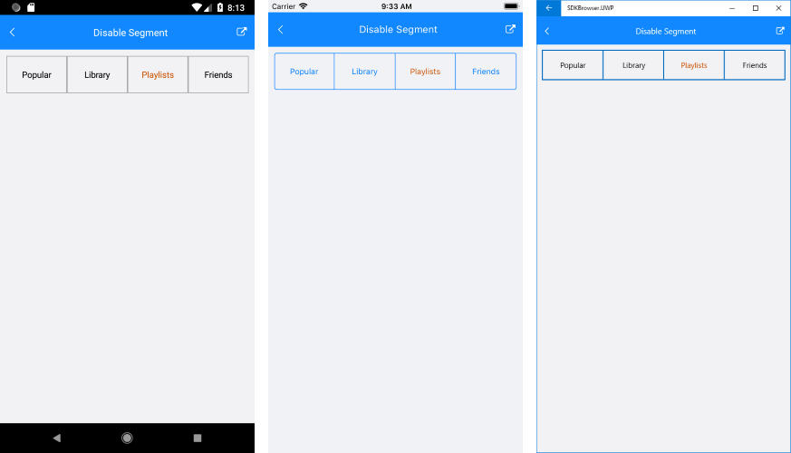

# Disable a Segment

RadSegmentedControl allows you to disable each of its segments individually. 

To disable a segment you can use the **SetSegmentEnabled** method. The method accepts two arguments **index** that determines the index of the segment. And **isEnabled** that determines whether the item is enabled or not.

You can also check if an item is enabled via the **IsSegmentEnabled** method. The method accepts a single argument - **index**.

### Setting a text color

You can set the text color of the disabled segment through the **DisabledSegmentTextColor**.

### Example

The following example shows how to disable a segment and define a color.

<snippet id='segmentcontrol-features-disablesegment-xaml'/>
<snippet id='segmentcontrol-features-disablesegment-csharp'/>

#### Figure 1: Disabled segment

 

### See Also

- [Project Wizard]()
- [Getting Started]()
- [Customize Segment Colors]()