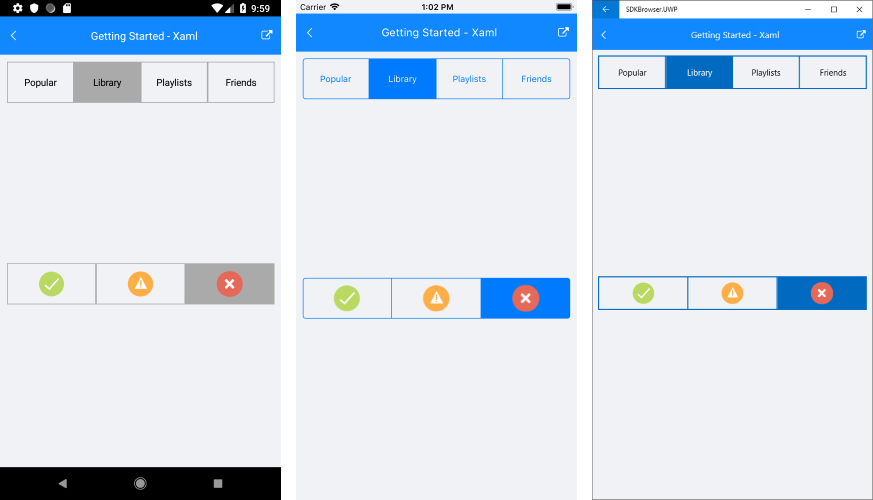

# Getting Started

This article demonstrates how to create a sample application that contains **RadSegmentedControl**.

>Before you proceed, please, take a look at these articles and follow the instructions to setup your app:

>- [Setup on Windows]()
>- [Setup on Mac]()

You can find the assemblies needed by the control in the [Required Telerik Assemblies]() article.

### Populating with data

The segment control allows you to work with two types of data - string and image. You can use the **ItemsSource** property of RadSegmentedControl to provide **IEnumerable** collection of strings or image sources. The control will display a segment for each item in the items source. 

### Setting segment colors

You can set the background of the segments via the **SegmentBackgroundColor** property. The color will be applied to all segments except the selected one. To change the background of the selected item you can set the **SelectedSegmentBackgroundColor**

To set the text color of the strings in the items via the **SegmentTextColor** property. The color of the selected segment can be set via the **SelectedSegmentTextColor** property.

You can find an example with the selected color properties in the [Selection]() article.

### Setting up RadSegmentControl

To use the tabview control you can include the following namespaces:

<snippet id='xmlns-telerikinput'/>
<snippet id='ns-telerikinput'/>

To display any segments you can set the control's ItemsSource property and populate it with some data.

<snippet id='segmentcontrol-gettingstarted-xaml'/>
<snippet id='segmentcontrol-gettingstarted-csharp'/>

#### __Figure 1: RadSegmentedControl example__  

### See Also

- [Project Wizard]()
- [Getting Started on Windows]()
- [Getting Started on Mac]()
