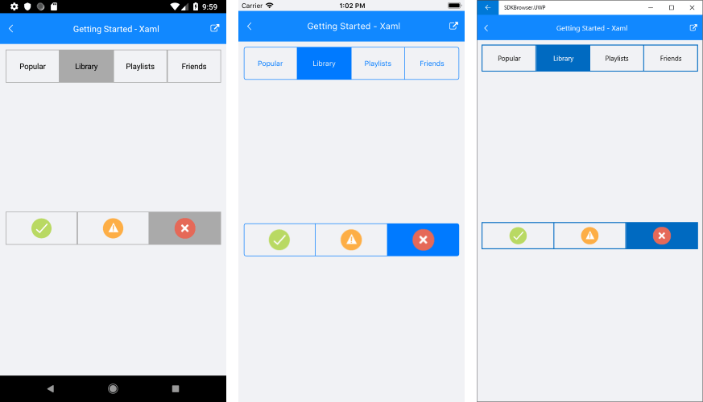

# Getting Started

This article will guide you through the steps needed to add a basic **RadSegmentedControl** control in your application.

## 1. Setting up the app

Take a look at these articles and follow the instructions to setup your app:

- [Setup app with Telerik UI for Xamarin on Windows]()
- [Setup app with Telerik UI for Xamarin on Mac]()

## 2. Adding the required Telerik references

You have two options:

* Add the Telerik UI for Xamarin Nuget package following the instructions in [Telerik NuGet package server]() topic.

If you don't want to add the all Telerik.UI.for.Xamarin nuget package, you have the option to add a separate nuget package. For RadSegmentedControl you have to install the **Telerik.UI.for.Xamarin.Input** nuget package. This nuget will automatically refer the Telerik.UI.for.Xamarin.Primitives, Telerik.UI.for.Xamarin.Common, and Telerik.UI.for.Xamarin.DataControls nuget packages.

* Add the references to Telerik assemblies manually, check the list below with the required assemblies for **RadSegmentedControl** component:

| Platform | Assemblies |
| -------- | ---------- |
| Portable | Telerik.XamarinForms.Common.dll Telerik.XamarinForms.Input.dll |
| Android  | Telerik.Xamarin.Android.Common.dll Telerik.Xamarin.Android.Input.dll Telerik.Xamarin.Android.Primitives.dll Telerik.Xamarin.Android.List.dll Telerik.Xamarin.Android.Data.dll Telerik.XamarinForms.Common.dll Telerik.XamarinForms.Input.dll |
| iOS      | Telerik.Xamarin.iOS.dll Telerik.XamarinForms.Common.dll Telerik.XamarinForms.Input.dll |
| UWP      | Telerik.Core.dll Telerik.Data.dll Telerik.UI.Xaml.Input.UWP.dll Telerik.UI.Xaml.Controls.Data.UWP.dll Telerik.UI.Xaml.Primitives.UWP.dll Telerik.XamarinForms.Common.dll Telerik.XamarinForms.Input.dll |

## 3. Adding RadSegmentedControl control

If your app is setup, you are ready to add a **RadSegmentedControl** control.

RadSegmentedControl allows you to work with two types of data - string and image. You can use the **ItemsSource** property of RadSegmentedControl to provide **IEnumerable** collection of strings or image sources. The control will display a segment for each item in the items source. 

### Populate with string data

Here is an example how to set the control's ItemsSource property and populate it with some data.

<snippet id='segmentcontrol-gettingstarted-xaml'/>
<snippet id='segmentcontrol-gettingstarted-csharp'/>

You also have to add the following namespace:

<snippet id='xmlns-telerikinput'/>
<snippet id='ns-telerikinput'/>

### Populate with image sources

<snippet id='segmentcontrol-gettingstarted-images-xaml' />
<snippet id='segmentcontrol-gettingstarted-images-csharp' />

This is the result:

## 4. Setting segment colors

You can set the background of the segments via the **SegmentBackgroundColor** property. The color will be applied to all segments except the selected one. To change the background of the selected item you can set the **SelectedSegmentBackgroundColor**

To set the text color of the strings in the items via the **SegmentTextColor** property. The color of the selected segment can be set via the **SelectedSegmentTextColor** property.

You can find an example with the selected color properties in the [Selection]() article.

>important **SDK Browser** and **QSF** applications contain different examples that show RadSegmentedControl's main features. You can find the applications in the **Examples** and **QSF** folders of your local **Telerik UI for Xamarin** installation.

### See Also

- [Selection]()
- [Disable segment]()
