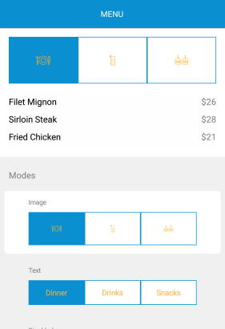

# Overview

**RadSegmentedControl for Xamarin** allows you to display a list of horizontally aligned, mutually exclusive options, which can be selected by the user. Each option is a button that can display a text or an image.

> **RadSegmentedControl** is available for the following platforms:
> - **Android**
> - **iOS**
> - **Universal Windows Platform**

#### Figure 1: RadSegmentedControl Overview

 

### Key features

* **Selection**: RadSegmentedControl exposes a few useful properties that can help you work with the items selection. For additional info on this read [here]().
* **Disabling segments**: You can disable the interactions with a specific segment and also set a specific color for this state. Read [here]() for more details on the matter.
* **Customizable segment colors**: You can customize the colors of the segments in the different states - normal, selected, disabled. Check [here]() for more info on this.

### See Also

- [Getting Started]()
