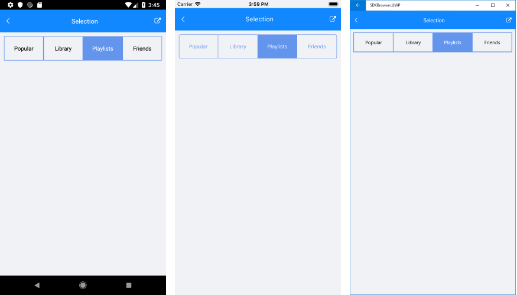

# Selection

**RadSegmentedControl** control exposes few useful properties which can help you work with the items selection. 

### Setting the selected segment 

The segment control has a **SelectedIndex** property which you can use to set the selected item.

### Setting selection colors

You can define custom colors for the text and the background of the selected segment. You can do that via the the following properties of **RadSegmentedControl**:

- **SelectedSegmentBackgroundColor**
- **SelectedSegmentTextColor**

### Selection changed

RadSegmentedControl exposes a SelectionChanged event which is fired when the selected item is updated.

* **SelectionChanged**: Occurs when the selected item is changed programatically or due to user interaction. The SelectionChanged event handler receives two parameters:
	* The sender argument which is of type object, but can be cast to the RadSegmentedControl type.
	* A __ValueChangedEventArgs&lt;int&gt;__ object which provides old and new value of the SelectedIndex. 

### Example

This example demonstrates how you could utilize the selection feature of RadSegmentedControl.

First, let's create a ViewModel class containing the SegmentedControl items and int property for defining the SelectedIndex:

<snippet id='segmentcontrol-features-selection-viewmodel' />

Then, add the SegmentedControl definition and apply ItemsSource, SelectedIndex as well as selection colors properties:

<snippet id='segmentcontrol-features-selection-xaml'/>

Lastly, define the ViewModel as BindingContext of the control:

<snippet id='segmentcontrol-features-selection-setviewmodel' />

The screenshot below shows the result on different platforms:

 

### See Also
- [Getting Started]()
- [Customize Segment Colors]()