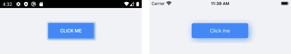
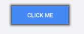
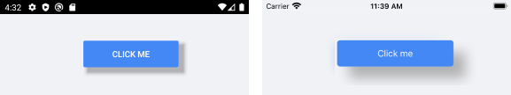
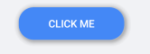

# Key Features

The purpose of this help article is to show you the key features of the **RadShadow** control. 

## Setting Shadow Color

Through the **Color** property you can paint the shadow that wraps around your views – you can make it consistent with the colors of the surrounded controls, or you can just use a softer color to make the shadow look more natural.
 
Here is a quick example of a colored shadow around RadButton: 

<snippet id='shadow-features-color'/>

Check the result below:

## Defining Transparency

Through **ShadowOpacity** you can control the color transparency level of the RadShadow. The defined value should be between 0 and 1, by default ShadowOpacity is set to 0.26.

<snippet id='shadow-features-opacity'/>

And how it looks:

## Defining Shadow Position

RadShadow exposes **OffsetX** and **OffsetY** properties used to specify the shadow’s position relative to the position of the view that is casting it. Positive x/y offsets will shift the shadow to the right and down, while negative offsets shift the shadow to the left and up.
  
By default, **OffsetX** and **OffsetY** are set to 0.00, so that the shadow appears on all sides of the View it surrounds. 

<snippet id='shadow-features-position'/>

Check the result below:

## Applying Corner Radius 

The **CornerRadius** property represents the degree to which the corners of the Shadow are rounded-  this is useful in cases RadShadow wraps around a view with rounded edges. 

Check below a quick example with RadButton with CornerRadius applied: 

<snippet id='shadow-features-cornerradius'/>

In this way the shadow looks consistent with the rounded button:

## Applying Blur Radius

Through the **BlurRadius** property you can specify the shadow blur-level  - the higher the number, the more blurred it will be, and the further out the shadow will extend. 

By default, the **BlurRadius** is 10.

<snippet id='shadow-features-blurradius'/>

 

>You may notice some differences in blur effect depending on the target platform. This is due to the different native implementations of the Shadow BlurRadius – on iOS it is implemented as a [Gaussian blur](https://developer.apple.com/documentation/swiftui/text/blur(radius:opaque:)), while on Android and UWP the shadow blur effect is determined by the elevation of the surrounded view. 

## See Also

- [Getting Started]()
