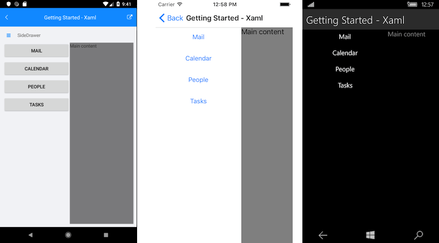

# Getting Started

This example will guide you through the steps needed to add a basic **RadSideDrawer** control in your application.

>Before you proceed, please, take a look at these articles and follow the instructions to setup your app:

>- [Setup on Windows]()
>- [Setup on Mac]()

## Example

If your app is setup, you are ready to add a **RadSideDrawer** control.

You can proceed with defining the component:

<snippet id='sidedrawer-gettingstarted-xaml'/>
<snippet id='sidedrawer-gettingstarted-csharp'/>

You also have to add the following namespace:

<snippet id='xmlns-telerikprimitives'/>
<snippet id='ns-telerikprimitives'/>

Here is the result:
 

## See Also

- [Project Wizard]()
- [Getting Started on Windows]()
- [Getting Started on Mac]()