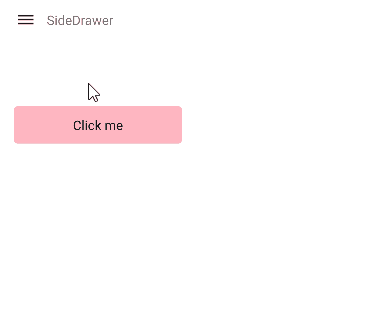

# Properties

This article explains all configuration options that the SideDrawer control provides.

## Content

Use the folloing properties to define content of the SideDrawer control:

* `DrawerContent`(`View`)&mdash;Specifies the drawer (initially hidden) content.
* `MainContent`(`View`)&mdash;Specifies the (initially visible) content of the component.

## Drawer behavior

* `IsOpen`(`bool`)&mdash;Specifies a value indicating if the drawer content is visible.
* `DrawerLength`(`double`)&mdash;Defines how much the drawer content should be extended over the main content in opened position.
* `DrawerLocation`(`SideDrawerLocation`)&mdash;Specifies the location from which the drawer will be opened. The following options are available:
	* `Left` 
	* `Right`
	* `Top`
	* `Bottom`

* `DrawerTransitionDuration`(`double`)&mdash;Defines the duration of the chosen transition.
* `DrawerTransitionType`(of type `Telerik.XamarinForms.Primitives SideDrawerTransitionType`)&mdash;Defines the transition of the component. This property can be set to one of the following values: 
	* **Fade**, **Push**, **Reveal**, **ReverseSlideOut**, **ScaleUp**, **SlideAling**, **SlideInOnTop**, **Custom**
	
* `DrawerTransitionFadeOpacity`(`double`)&mdash;Defines the opacity of the fade layer of the component. This controls the fade layer opacity on Android or the dim opacity on iOS.

* `AreGesturesEnabled`(`bool`)&mdash;This is a mobile exclusive property which specifies ability for gestures to open and close the drawer.
* `TouchTargetThreshold`(`double`)&mdash;Defines the touchable area (number of pixels from the screen edges) that will allow to open the DrawerContent. 

## Keep Drawer open and main content area active

By default the SideDrawer Drawer Content closes when user clicks/taps outside of it. By setting the `TapOutsideToClose`(`bool`) to `false`, the drawer content remains open if the user taps/clicks outside of it and the main content area remains active. The default value of `TapOutsideToClose` is `true`.

>important A sample Location example can be found in the SideDrawer/Features folder of the [SDK Samples Browser application]().

## See Also

[Events]()
[Commands]()
